# INFORME DE AVANCE - PRIMERAS DOS SEMANAS DE CLASES

**Estudiante:** Anyelo Manuel Rodríguez Sandoval  
**Programa:** Ingeniería de Sistemas  
**Institución:** Universidad de La Guajira  
**Asignatura / Proyecto:** Bases De Datos II  
**Docente:** ING. JAIDER J. QUINTERO MENDOZA 

## 1. Introducción
En estas primeras dos semanas de clases arrancamos con la parte práctica, organizando el entorno de trabajo y preparando las herramientas clave para montar nuestra base de desarrollo. Este informe resume paso a paso lo que hemos hecho hasta ahora: desde la configuración inicial en los equipos hasta la instalación y puesta en marcha de los motores y servicios que vamos a utilizar en los laboratorios de la materia.

# 1. Configuración e Instalación del Entorno (WSL y Ubuntu)

Como en el sistema inicial no contábamos con el Subsistema de Windows para Linux (WSL) ni con la distribución de Ubuntu instalada, fue necesario realizar el proceso de configuración directamente desde la terminal de **PowerShell**. A continuación, se muestra el paso a paso detallado de este proceso de implementación:

---

## 1.1. Inicialización de WSL
Abrimos la consola de **Windows PowerShell** con privilegios de administrador y ejecutamos el comando principal para habilitar las características necesarias de virtualización y el subsistema:

```powershell
wsl --install
```
**Instalación inicial de WSL**
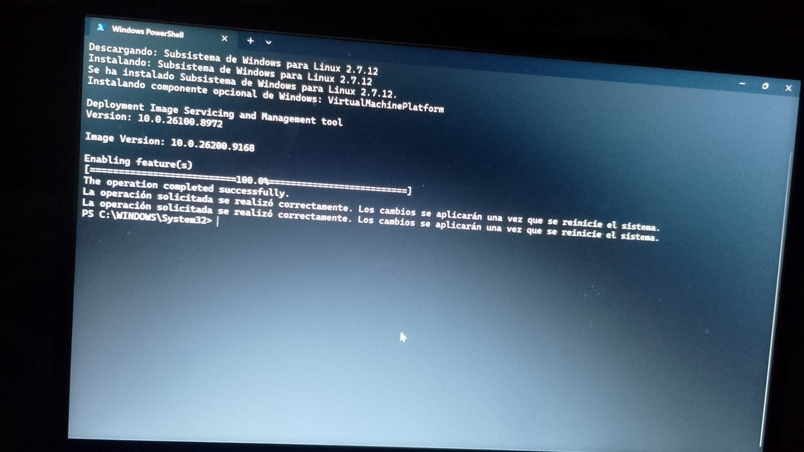
**Resultado:** Al final fue un exito la instalacion de wsl ya que se pudo descargar sin complicaciones.

## 1.2. Instalación de la Distribución de Linux (Ubuntu 24.04 LTS)
Para asegurar una versión estable y moderna del sistema operativo, procedemos a instalar la distribución específica de **Ubuntu 24.04 LTS** ejecutando el comando correspondiente:

```powershell
wsl --install -d Ubuntu-24.04
```
**Instalación de Ubuntu 24.04 LTS y creación de usuario**
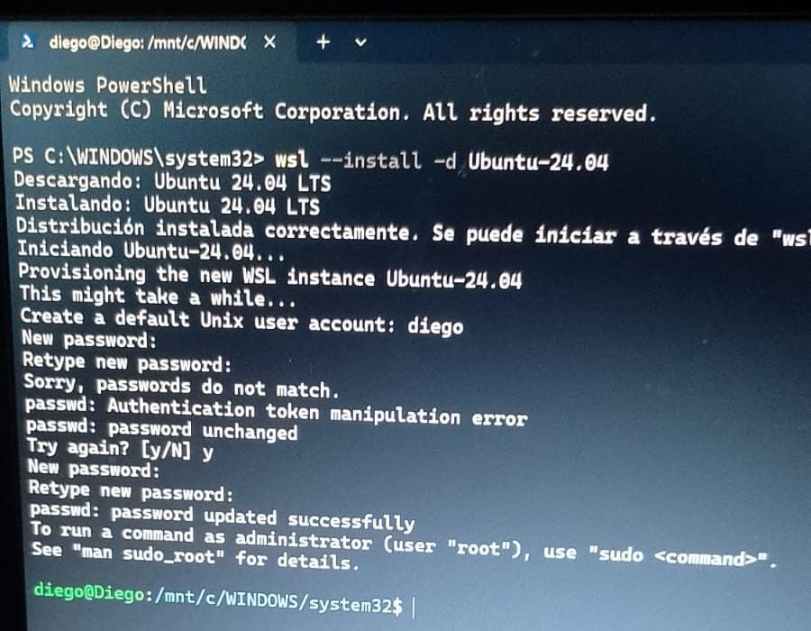
**Rsultado:** Ubunto se instalo exitosamente con el comando que esta en la descripcion y ademas se instalo la version deseada. 

## 1.3. Verificación de Herramientas y Contenedores en Ubuntu
Una vez configurado el acceso al sistema operativo e inicializado el entorno de Linux, procedemos a verificar la disponibilidad del gestor de paquetes, así como la correcta instalación y versión de las herramientas de contenedorización (Docker y Docker Compose).

```bash
sudo docker --version
docker compose version
```
**Verificación de Docker y Docker Compose en Ubuntu**
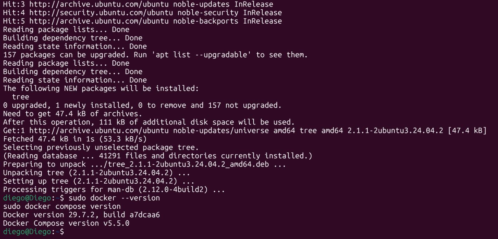
**Resultado:**Las versiones de docker fuero instalada con exito y las versiones la poemos observar en la imagen.
## Creación de directorios y estructura
Abrimos la consola para armar toda la jerarquía de carpetas que usaremos con los motores de bases de datos, y luego comprobamos que todo haya quedado en su sitio:

```bash
mkdir ia-lab
cd ia-lab
```
```bash
mkdir -p services/motores-bd/{mysql,postgres,mssql,oracle} data/{mysql,postgres,mssql,oracle}
tree
```

El esquema de directorios que nos arroja el sistema es el siguiente:
```bash
~/ia-lab/
├── services/
│   └── motores-bd/
│       ├── mysql/
│       ├── postgres/
│       ├── mssql/
|       |__ oracle/
└── data/
  ├── mysql/
  ├── postgres/
  └── mssql/
  └── oracle/
Estructura de carpetas generada para el laboratorio de bases de datos
```
**Visualización del árbol de directorios creado en la terminal**
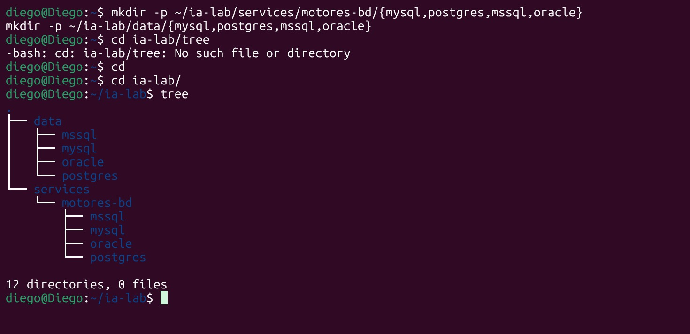
**Resultado:** Al ejecutar los comando para crear las carpetas de servicios y dato y verificar con tree que todos los directorios quedaran organizados perfectamente para MySQL, PostgreSQL, MS SQL Server y Oracle.
## Configuración de la red compartida en Docker

Para que los contenedores se comuniquen sin problemas entre ellos, configuramos una red personalizada en Docker. Desde la consola ejecutamos la instrucción que valida su existencia y, de no estar creada, la levanta automáticamente:

```bash
sudo docker network inspect ia-lab-network >/dev/null 2>&1 || docker network create ia-lab-network
```
Posteriormente, comprobamos mediante un filtro que la red se generó de manera exitosa:
```bash
sudo docker network ls | grep ia-lab
```
**Evidencia de la creación de la red Docker compartida**
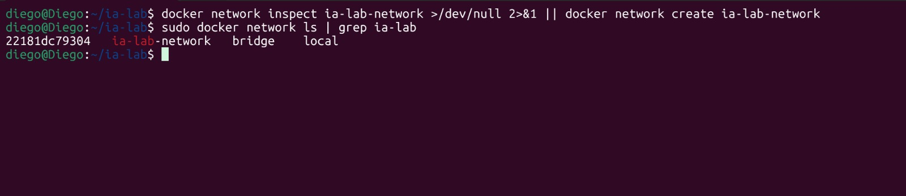

**Resultado:** El proceso fue un éxito total, ya que la red se configuró correctamente y sin ninguna complicación en el entorno.

## Configuración y Despliegue de MySQL con Docker Compose

Para configurar nuestro contenedor de base de datos MySQL, genero el archivo de orquestación dentro de su respectiva carpeta ejecutando el siguiente bloque de comandos en la terminal:

```bash
cat > ~/ia-lab/services/motores-bd/mysql/docker-compose.yml << 'EOF'
services:
  mysql:
    image: mysql:8.0
    container_name: mysql-server
    restart: unless-stopped
    env_file:
      - .env
    ports:
      - "3306:3306"
    volumes:
      - ../../../data/mysql:/var/lib/mysql
      - /mnt/d/academia/bd:/backups
    command: >
      --character-set-server=utf8mb4
      --collation-server=utf8mb4_unicode_ci
      --bind-address=0.0.0.0
    networks:
      - ia-lab-network
    healthcheck:
      test: ["CMD", "mysqladmin", "ping", "-h", "localhost"]
      interval: 10s
      timeout: 5s
      retries: 5
      start_period: 30s

networks:
  ia-lab-network:
    external: true
EOF
```
**Evidencia de la creación e inserción del archivo de configuración para MySQL**
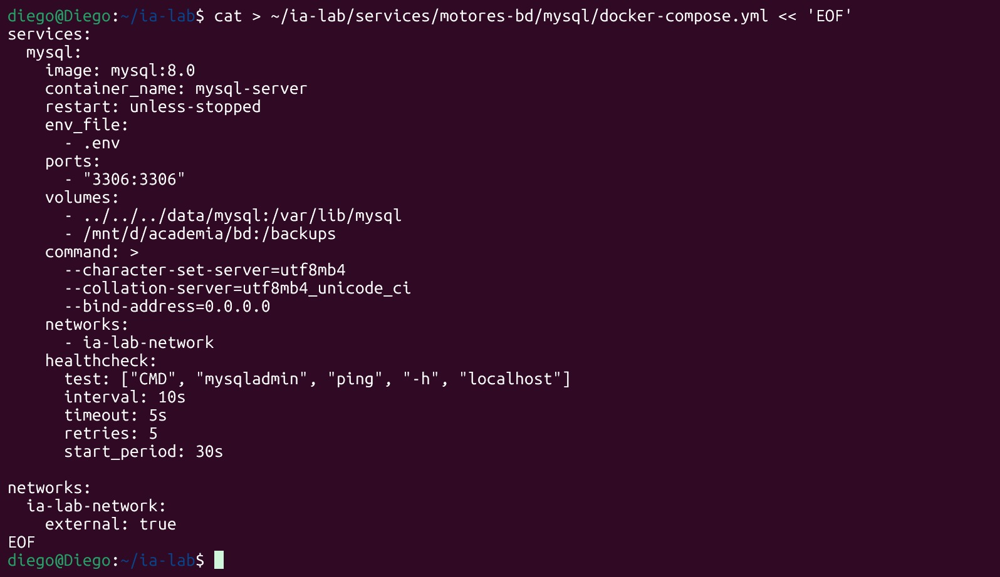

**Resultado:** El proceso se ejecutó de forma exitosa, creando el archivo de orquestación de manera correcta y sin complicaciones en el sistema.

## Configuración de Variables de Entorno  (`README.md`) para MySQL

Para establecer parámetros clave como la zona horaria, la contraseña de administrador y el nombre de la base de datos de MySQL, creo el archivo de entorno `.env` en su respectiva ruta ejecutando el comando:

```bash
cat > ~/ia-lab/services/motores-bd/mysql/.env << 'EOF'
TZ=America/Bogota
MYSQL_ROOT_PASSWORD=1234
MYSQL_DATABASE=ActivaFit
EOF
```
**Evidencia de la creación del archivo de variables de entorno y su posterior verificación**
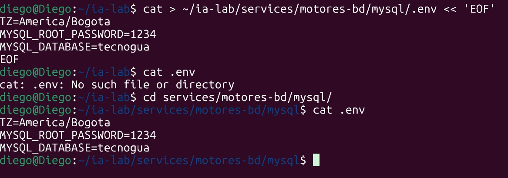

**Resultado:** La operación se completó de forma exitosa, logrando validar el contenido del archivo de configuración dentro de la carpeta correspondiente sin ningún inconveniente.

## Generación de Documentación (README.md) para MySQL

Con el fin de registrar de manera clara las credenciales y especificaciones técnicas de este motor, creo un archivo de documentación (`README.md`) directamente en el directorio de MySQL mediante los siguientes comandos:

```bash
touch ~/ia-lab/services/motores-bd/mysql/README.md
sudo nano ~/ia-lab/services/motores-bd/mysql/README.md
```
Dentro del archivo redacto y almaceno la siguiente información clave de referencia:
```bash
# MySQL 8.0 - Motor de Base de Datos
> **Acceso remoto habilitado.** Puerto expuesto en `0.0.0.0:3306`.
> **Usuario por defecto:** `root`
> **Base de datos inicial:** `tecnogua`
> **Password:** `1704`
```

**Evidencia de la creación, lectura y prueba de conexión local del archivo README.md de MySQL**
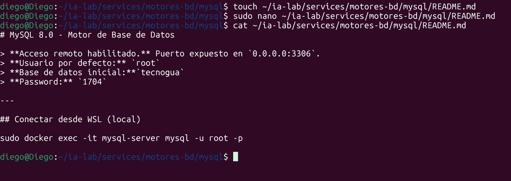

**Resultado:** El proceso se ejecutó con gran éxito, permitiendo verificar la documentación técnica y el comando de acceso local al contenedor sin ninguna complicación.
## Puesta en Marcha del Contenedor de MySQL

Para arrancar el servicio, me desplazo hasta la carpeta correspondiente y ejecuto el comando de Docker Compose para levantar el contenedor de forma desacoplada:

```bash
cd ~/ia-lab/services/motores-bd/mysql
sudo docker compose up -d
```
**Evidencia de la ejecución de Docker Compose para levantar el contenedor de MySQL y su respectiva validación de estado activo y saludable**
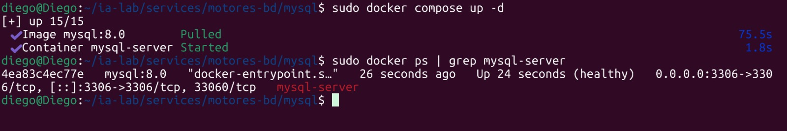

**Resultado:** La puesta en marcha fue un éxito total, comprobando que el contenedor subió correctamente, expuso el puerto y se encuentra en estado saludable sin ningún inconveniente.

## Creación de Usuario y Base de Datos con Acceso Remoto

Para evitar depender únicamente del usuario `root` y configurar mi propio acceso personalizado, ingresé de manera directa al contenedor de MySQL usando las credenciales de administración:

```bash
sudo docker exec -it mysql-server mysql -u root -p
```
Ya dentro de la consola del motor, procedí a crear la base de datos y a configurar mi usuario con permisos desde cualquier ubicación:
```bash
-- Creé mi base de datos con soporte utf8mb4
CREATE DATABASE ActivaFit CHARACTER SET utf8mb4 COLLATE utf8mb4_unicode_ci;

-- Creé mi usuario con acceso remoto (%)
CREATE USER 'admin'@'%' IDENTIFIED BY '1234';

-- Le di privilegios totales sobre mi base de datos
GRANT ALL PRIVILEGES ON *.* TO 'admin'@'%';
GRANT ALL PRIVILEGES ON ActivaFit.* TO 'admin'@'%';

FLUSH PRIVILEGES;
EXIT;
```
**Evidencia de la conexión exitosa al monitor de MySQL como root y la posterior creación del usuario con privilegios, junto con la verificación de las bases de datos disponibles en el sistema**

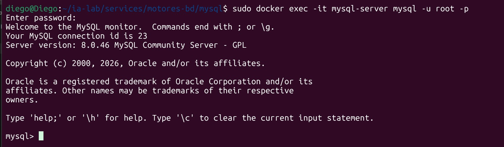
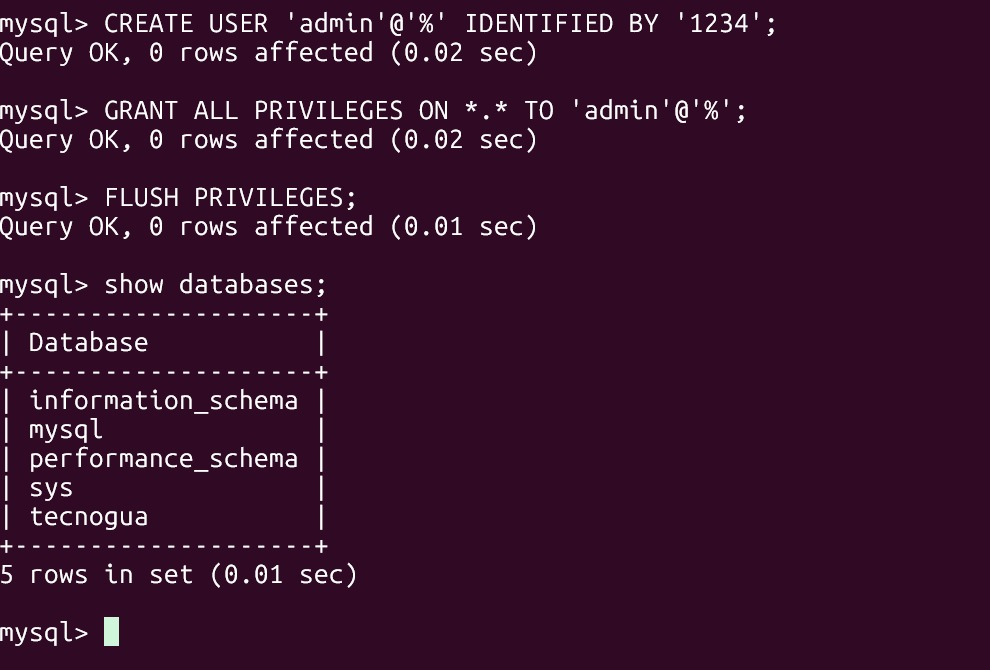

**Resultado:** Todo el proceso fluyó de maravilla, logrando autenticarnos en el motor, configurar los permisos del usuario y listar las bases de datos sin ninguna complicación.
## Conexión Externa desde DBeaver

Para comprobar que podía gestionar todas las tablas cómodamente desde una interfaz gráfica fuera de la consola, consulté la dirección IP asignada a mi entorno WSL ejecutando el siguiente comando:

```bash
ip a
```
**Evidencia de la consulta de las interfaces de red del sistema mediante el comando `ip a` para identificar la dirección IP asignada a WSL**

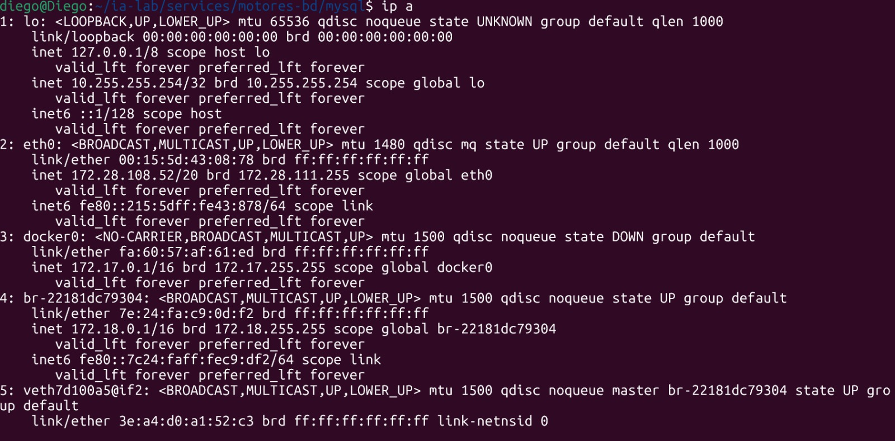

**Resultado:** Todo salió a la perfección, logrando visualizar las interfaces de red y extraer la IP necesaria para entablar la conexión externa sin ninguna complicación.
## Configuración de la Conexión en DBeaver

Tomando la IP obtenida previamente, configuré una nueva conexión en el gestor gráfico DBeaver utilizando los siguientes parámetros específicos:

| Parámetro | Valor |
| :--- | :--- |
| **Host** | `172.21.63.86` |
| **Puerto** | `3306` |
| **Base de datos** | `tecnogua` |
| **Usuario** | `admin` |
| **Contraseña** | `1234` |

**Evidencia de la prueba de conexión exitosa desde DBeaver con la versión del servidor MySQL 8.0.46 y el panel principal mostrando la conexión establecida al servidor de bases de datos**

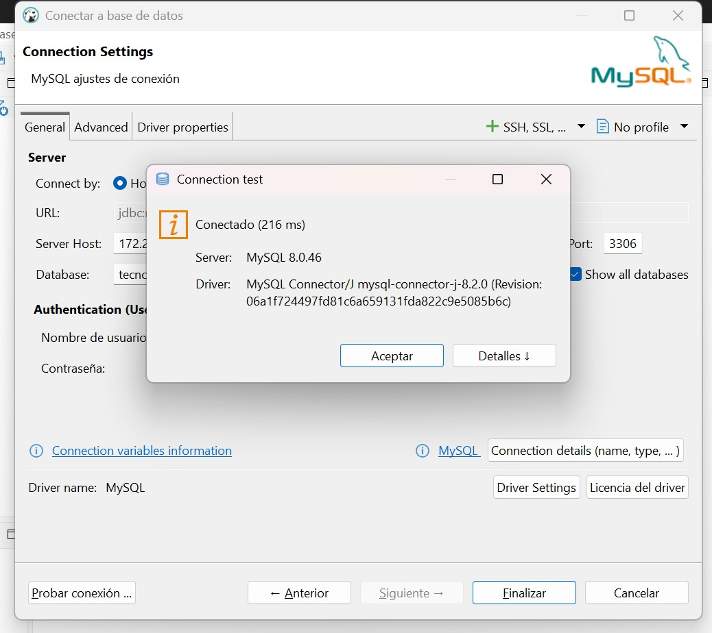
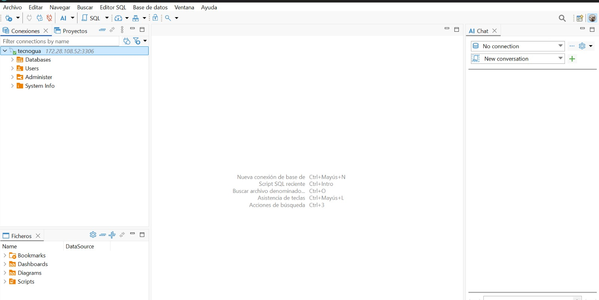

**Resultado:** Todo quedó perfecto, logrando comprobar la conexión de manera gráfica, validando el funcionamiento del driver y viendo el proyecto listo y sin ninguna complicación.

## Configuración y Despliegue de PostgreSQL

Tras concluir la implementación de MySQL, procedo a configurar el motor de PostgreSQL dentro de la estructura de servicios del laboratorio. Para ello, me ubico en la ruta correspondiente y creo el archivo de orquestación ejecutando el siguiente bloque de comandos en la terminal:

```bash
cat > ~/ia-lab/services/motores-bd/postgres/docker-compose.yml << 'EOF'
services:
  postgres:
    image: postgres:17
    container_name: postgres-server
    restart: unless-stopped

    env_file:
      - .env

    ports:
      - "5432:5432"

    volumes:
      # Datos persistentes dentro de WSL
      - ../../../data/postgres:/var/lib/postgresql/data

      # Backups accesibles desde Windows (D:)
      - /mnt/d/academia/bd:/backups

    command:
      - postgres
      - -c
      - "listen_addresses=*"

    networks:
      - ia-lab-network

    healthcheck:
      test: ["CMD-SHELL", "pg_isready -U $$POSTGRES_USER -d$$POSTGRES_DB"]
      interval: 10s
      timeout: 5s
      retries: 5
      start_period: 20s

networks:
  ia-lab-network:
    external: true
EOF
```
**Evidencia de la creación del archivo docker-compose.yml para configurar y orquestar el servicio de PostgreSQL en el laboratorio**

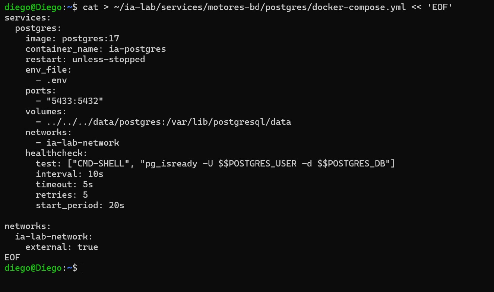

**Resultado:** Todo quedó perfecto, logrando redactar e inyectar el archivo de configuración del contenedor de forma limpia y sin ningún contratiempo en el sistema.

## Creación del Archivo .env para PostgreSQL

Para cuidar las credenciales y tener la configuración del contenedor bien separada, armé el archivo `.env` dentro de la misma carpeta del servicio corriendo este comando:

```bash
cat > ~/ia-lab/services/motores-bd/postgres/.env << 'EOF'
TZ=America/Bogota
POSTGRES_DB=ialab
POSTGRES_USER=ialab
POSTGRES_PASSWORD=MiNiCo57**
PGDATA=/var/lib/postgresql/data
EOF
```
**Evidencia de la creación del archivo de variables de entorno (.env) para configurar los parámetros de acceso, base de datos y zona horaria de PostgreSQL**

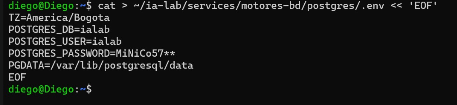

**Resultado:** Todo quedó perfecto, logrando dejar configuradas las credenciales de forma limpia y sin ningún contratiempo en la terminal.
## Creación del README de PostgreSQL

Para dejar documentada toda la información clave de acceso y configuración del motor en el repositorio, creé el archivo `README.md` directamente mediante un bloque de comandos en la terminal:

```bash
cat > ~/ia-lab/services/motores-bd/postgres/README.md << 'EOF'
# PostgreSQL 17 - Motor de Base de Datos

> **Acceso remoto habilitado:** Puerto expuesto en `0.0.0.0:5433`.
> **Usuario por defecto:** `ialab` (acceso remoto: sin restriccion de host)

---

## Conectar desde WSL (local)

```bash
docker exec -it ia-postgres psql -U ialab -d ialab
# Password: MiNiCo57**
> EOF
```
**Evidencia de la creación del archivo `README.md` de PostgreSQL mediante un bloque de comandos en la terminal para documentar los parámetros de acceso y conexión**

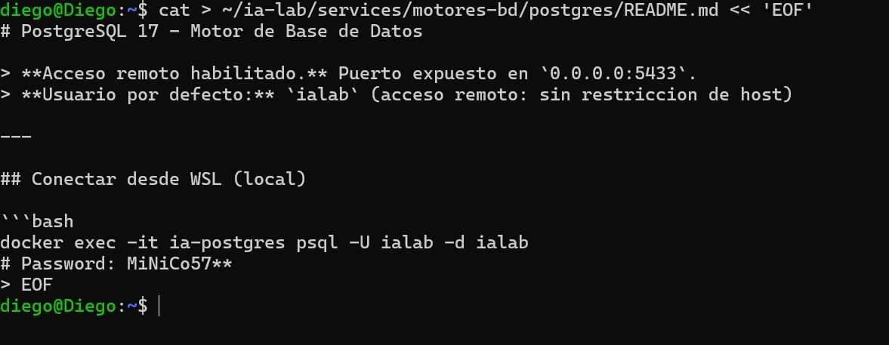

**Resultado:** Todo quedó excelente, logrando redactar e inyectar toda la documentación técnica de la guía de forma limpia y directa en la terminal.
## Despliegue del Contenedor de PostgreSQL

Una vez configurados el archivo `docker-compose.yml`, las variables de entorno y el `README.md`, me pasé a la carpeta correspondiente para levantar el servicio:

```bash
cd ~/ia-lab/services/motores-bd/postgres
```
**Evidencia del despliegue del contenedor de PostgreSQL ejecutando `docker compose up -d` tras ubicarse en la carpeta del servicio**

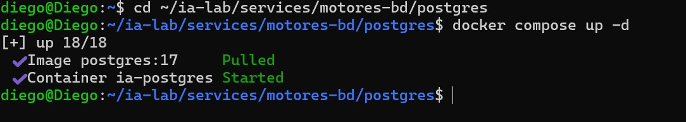

**Resultado:** Todo quedó perfecto, logrando descargar la imagen de Postgres y arrancar el contenedor (`ia-postgres`) en segundo plano sin ningún problema.

## Creacion del usuario con acceso remoto
Para conectarme directo al motor de la base de datos y tirar los comandos, lancé este comando en la terminal:

```bash
docker exec -it ia-postgres psql -U ialab -d ialab
```
Ya estando adentro y con la sesión iniciada, ejecuté las instrucciones SQL para crear mi usuario con privilegios de administrador y poder verificar que todo quedó bien creado:
```bash
CREATE USER admin WITH PASSWORD '1234';
ALTER USER admin WITH SUPERUSER;
\du
```
**Evidencia de la conexión al motor de base de datos dentro del contenedor y la ejecución de los comandos SQL para crear el rol de administrador y verificarlo con `\du`**

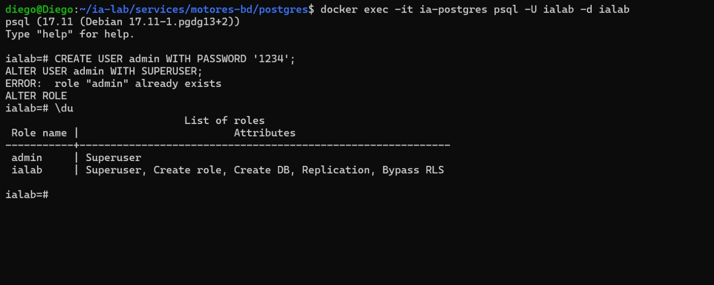

**Resultado:** Todo quedó perfecto; aunque el rol ya existía, se le aplicaron los privilegios correspondientes y al listar los roles (`\du`) se confirmó que tanto `admin` como `ialab` cuentan con permisos de Superuser sin ningún problema.

## Conexión a PostgreSQL desde DBeaver

Para comprobar que podía gestionar mis tablas desde una interfaz gráfica, saqué la IP de mi WSL ejecutando:

```bash
ip a
```
**Evidencia de la ejecución del comando `ip a` en la terminal de WSL para obtener la dirección IP y poder configurar la conexión al motor de base de datos desde Windows**

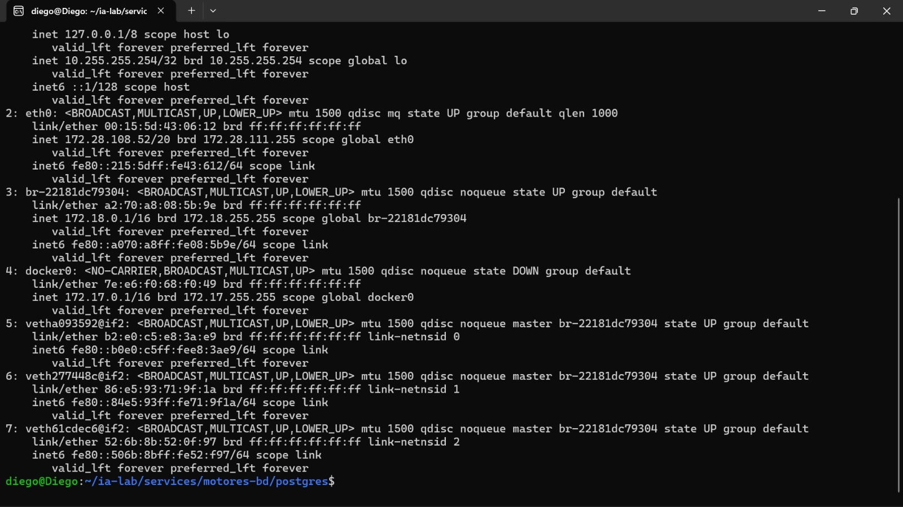

**Resultado:** Todo quedó excelente, logrando visualizar las interfaces de red y la dirección IP correspondiente para establecer la conexión sin ningún inconveniente.

Con esa IP, configuré la nueva conexión en DBeaver usando estos datos:
  * **Host:** `172.28.108.52` 
  * **Puerto:** `5433`
  * **Base de datos:** `tecnogua`
  * **Usuario:** `admin`
  * **Contraseña:** `1234`

**Evidencia de la prueba de conexión exitosa a PostgreSQL desde DBeaver utilizando la IP y el puerto configurados**

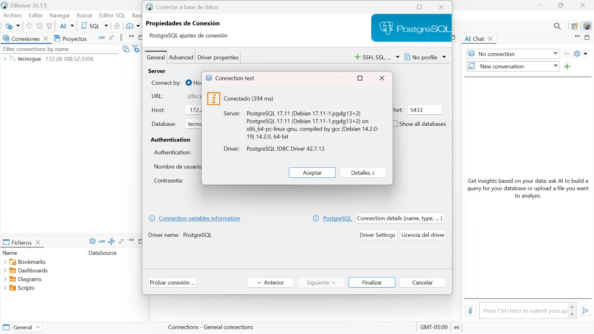

**Evidencia de la conexión establecida y guardada correctamente en el panel de DBeaver, mostrando el servidor activo con la base de datos lista para gestionar**

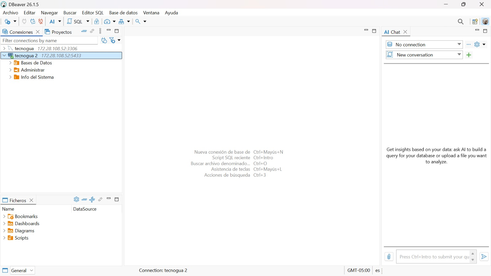

**Resultado:** Todo quedó conectado de forma exitosa, comprobando la comunicación correcta entre el entorno gráfico y el motor de base de datos.

## MS SQL Server

### Creación del archivo docker-compose.yml
Para levantar SQL Server, armé el archivo de configuración con la imagen oficial de Microsoft utilizando este contenido:

```bash
services:
  mssql:
    image: [mcr.microsoft.com/mssql/server:2022-latest](https://mcr.microsoft.com/mssql/server:2022-latest)
    container_name: mssql-server
    restart: unless-stopped
    user: root
    env_file:
      - .env
    ports:
      - "0.0.0.0:1433:1433"
    volumes:
      - ../../../data/mssql:/var/opt/mssql
      - /mnt/d/academia/bd:/backups
    networks:
      - ia-lab-network
    healthcheck:
      test: ["CMD-SHELL", "/opt/mssql-tools18/bin/sqlcmd -S localhost -U SA -P $$MSSQL_SA_PASSWORD -C -Q 'SELECT 1' || exit 1"]
      interval: 10s
      timeout: 5s
      retries: 10
      start_period: 40s

networks:
  ia-lab-network:
    external: true
```
**Evidencia de la creación del archivo `docker-compose.yml` para el servicio de SQL Server**

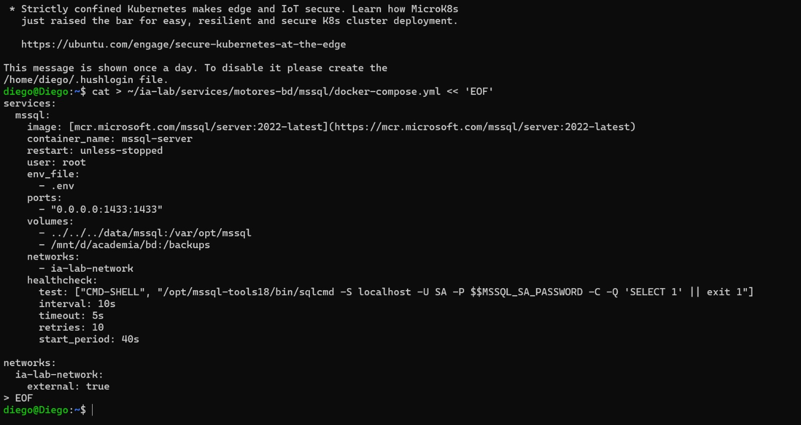

**Resultado:** Se configuró y guardó correctamente la estructura del contenedor con sus respectivos volúmenes y red.

**Creación del archivo `.env`**

Para establecer las credenciales de acceso, la zona horaria y la aceptación de la licencia del motor de base de datos, configuré el archivo de variables de entorno con el siguiente contenido:

```bash
cat > ~/ia-lab/services/motores-bd/mssql/.env << 'EOF'
TZ=America/Bogota
ACCEPT_EULA=Y
MSSQL_SA_PASSWORD=Elkin1234!
MSSQL_PID=Developer
EOF
```
Si requiero modificar estos parámetros más adelante, accedo a la ruta del servicio y edito el archivo mediante el comando:
```bash
cd ~/ia-lab/services/motores-bd/mssql
sudo nano .env
```
**Evidencia de la creación del archivo `.env`**

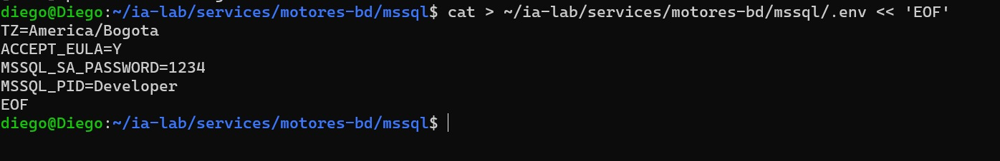

**Resultado:** Se definieron correctamente las variables de configuración, incluyendo la zona horaria, la aceptación de la licencia, la contraseña de administrador y la edición del entorno del motor de base de datos.
**Creación y documentación del archivo `README.md`**

Para dejar por escrito la descripción y los detalles de este servicio, procedí a crear y redactar el archivo `README.md` ejecutando:

```bash
touch ~/ia-lab/services/motores-bd/mssql/README.md
sudo nano ~/ia-lab/services/motores-bd/mssql/README.md
```
Dentro del archivo estructuré la información del proyecto de la siguiente manera:

```bash
# Configuración de Microsoft SQL Server (MSSQL)

Este directorio contiene la configuración mediante Docker Compose para desplegar una instancia de **SQL Server 2022** orientada al proyecto de base de datos.

## Estructura de archivos
- `docker-compose.yml`: Archivo de configuración del contenedor.
- `.env`: Variables de entorno para la configuración de la instancia (credenciales y licencia).

## Credenciales y Parámetros
- **Puerto:** `1433`
- **Usuario Administrador:** `SA`
- **Edición (`MSSQL_PID`):** `Developer`
- **Zona Horaria:** `America/Bogota`
```
Para verificar que el contenido hubiera quedado guardado correctamente, utilicé el comando:
```bash
cat ~/ia-lab/services/motores-bd/mssql/README.md
```
**Evidencia de la creación y visualización del archivo `README.md`**

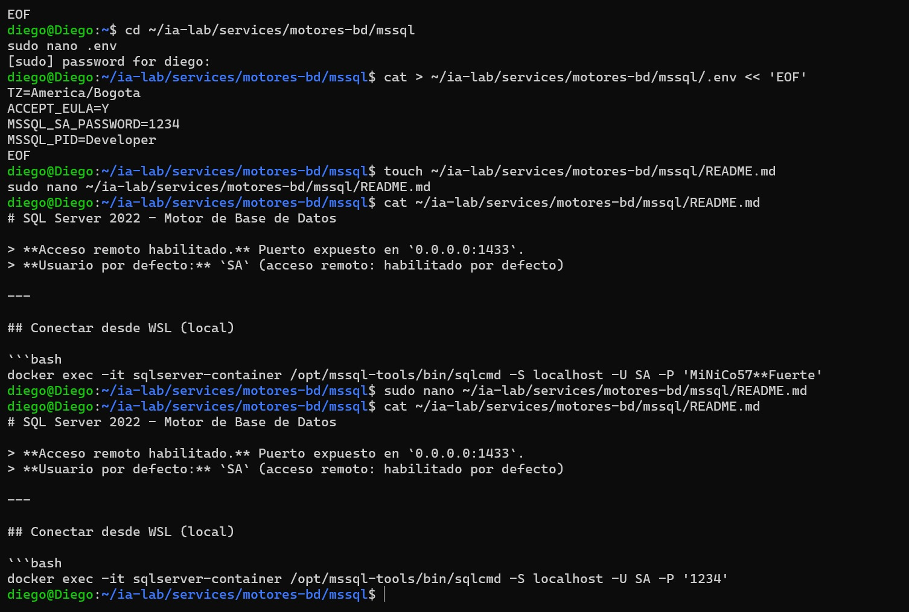

**Resultado:** Se generó y verificó correctamente la documentación interna con las especificaciones y los comandos para conectar la base de datos.
**Despliegue del contenedor de MSSQL**

Una vez configurados el archivo `docker-compose.yml`, el archivo de variables de entorno `.env` y la documentación, procedí a levantar el servicio ejecutando los siguientes comandos:

```bash
cd ~/ia-lab/services/motores-bd/mssql
docker compose up -d
```
Verifiqué que el contenedor mssql-server estuviera corriendo mediante el comando:
```bash
sudo docker ps | grep mssql-server
```
Para comprobar de forma general el estado de ejecución del contenedor y su correcta inicialización, consulté los contenedores activos:
```bash
docker ps
```
## Instalar mssql-tools en WSL
Posteriormente, para poder administrar y enlazarme con la base de     datos desde el entorno de Ubuntu 24.04, efectué la instalación de `mssql-tools18` junto con `unixODBC` completando el siguiente          procedimiento:
**Puesta al día del sistema y obtención de dependencias:**
 ```bash
  sudo apt update && sudo apt install -y curl ca-certificates gnupg
   ```

Limpieza de fuentes de Microsoft obsoletas: (Realicé esto para prevenir contratiempos con configuraciones pasadas de Ubuntu 22.04 y evitar el uso de apt-key)
 ```bash
sudo rm -f /etc/apt/sources.list.d/mssql-release.list
sudo rm -f /etc/apt/sources.list.d/microsoft-prod.list
```
Obtención del paquete oficial de Microsoft diseñado para Ubuntu 24.04:
 ```bash
cd /tmp
curl -sSL -O [https://packages.microsoft.com/config/ubuntu/24.04/packages-microsoft-prod.deb](https://packages.microsoft.com/config/ubuntu/24.04/packages-microsoft-prod.deb)
```
Registro del repositorio oficial en el sistema:
 ```bash
sudo dpkg -i packages-microsoft-prod.deb
```
Refrescar los repositorios locales:
```bash
sudo apt update
```
Comprobación de la integración del repositorio:
```bash
grep -R "packages.microsoft.com" /etc/apt/sources.list /etc/apt/sources.list.d/ 2>/dev/null
```
Instalación de las herramientas de administración y controladores ODBC:
```bash
sudo ACCEPT_EULA=Y apt install -y mssql-tools18 unixodbc-dev
```
Incorporación de la ruta de herramientas al PATH:
```bash
echo 'export PATH="$PATH:/opt/mssql-tools18/bin"' >> ~/.bashrc
```
Actualización de la terminal con los cambios:
```bash
source ~/.bashrc
```
Validación final del comando sqlcmd:
```bash
which sqlcmd
```
Verificando que devuelva correctamente la ruta /opt/mssql-tools18/bin/sqlcmd.

## Instalación de herramientas y verificación de conexión (`sqlcmd`)

Para gestionar de forma directa las bases de datos desde la línea de comandos en WSL, incorporé las utilidades oficiales `mssql-tools18` junto con `unixODBC`. Acto seguido, validé la comunicación mediante la instrucción de acceso:

```bash
sqlcmd -S localhost -U SA -P "Elkin1234!" -C
```
**Resultado:** Conseguí instalar de manera óptima las herramientas de administración sobre Ubuntu 24.04 y establecí una conexión exitosa con el motor de MS SQL Server empleando el usuario administrador SA desde la terminal, comprobando que el sistema de bases de datos se encuentra totalmente operativo.

## Conexión local y remota al servidor SQL

Para interactuar de manera local con la instancia del motor, lancé el comando de ejecución dentro del contenedor utilizando la contraseña predefinida:
```bash
sudo docker exec -it mssql-server /opt/mssql-tools18/bin/sqlcmd -S localhost -U SA -P 'Elkin1234!' -C
```
Ya situados en la consola interactiva, procedí a inicializar y generar el esquema principal de datos para el proyecto tecnogua:
```bash
CREATE DATABASE TecnoGua;
GO
```
Si es necesario consultar los catálogos y listados de bases de datos existentes en el servidor, empleé la siguiente sentencia:
```bash
SELECT name FROM sys.databases;
GO
```
## Creación del usuario administrador
Una vez asegurado que la base de datos tecnogua y sus tablas operan correctamente, procedí a dar de alta un perfil de acceso administrativo para las tareas de gestión externa, otorgándole los privilegios de servidor mediante la ejecución individual de cada instrucción (escribiendo y enviando el comando GO por separado tras cada una):
**Registro del inicio de sesión:**
```bash
CREATE LOGIN admin WITH PASSWORD = '1234', CHECK_POLICY = OFF;
GO
```
**Asignación de privilegios de nivel superior (sysadmin):**
```bash
ALTER SERVER ROLE sysadmin ADD MEMBER admin;
GO
```
**Habilitación de la cuenta de acceso:**
```bash
ALTER LOGIN admin ENABLE;
GO
```
**Evidencia de la consulta, creación de la base de datos `Tecnogua` y configuración del usuario `admin`**

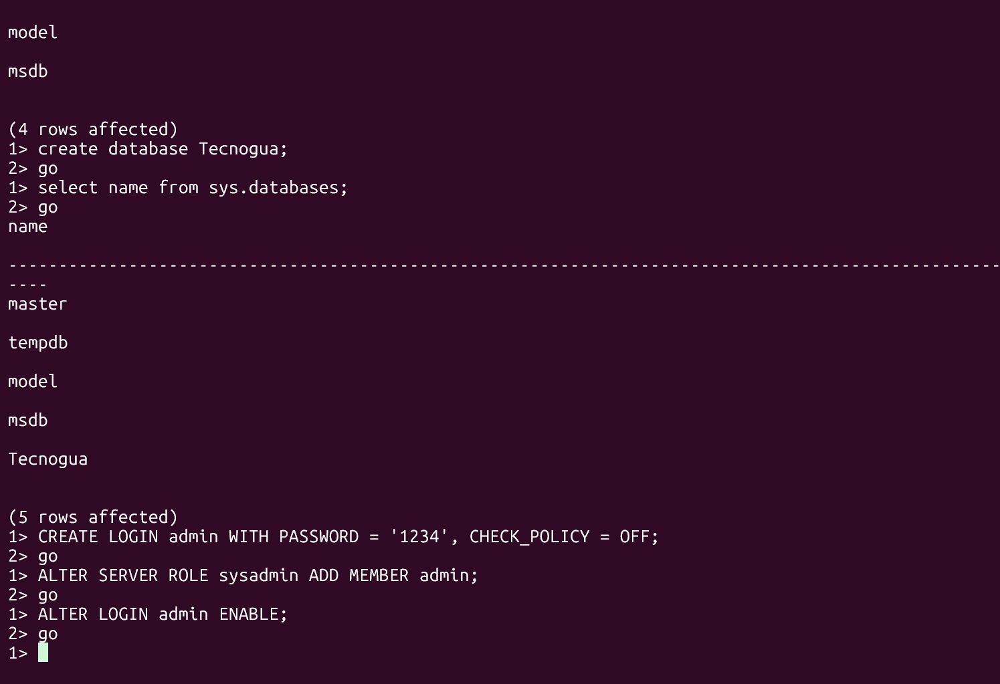

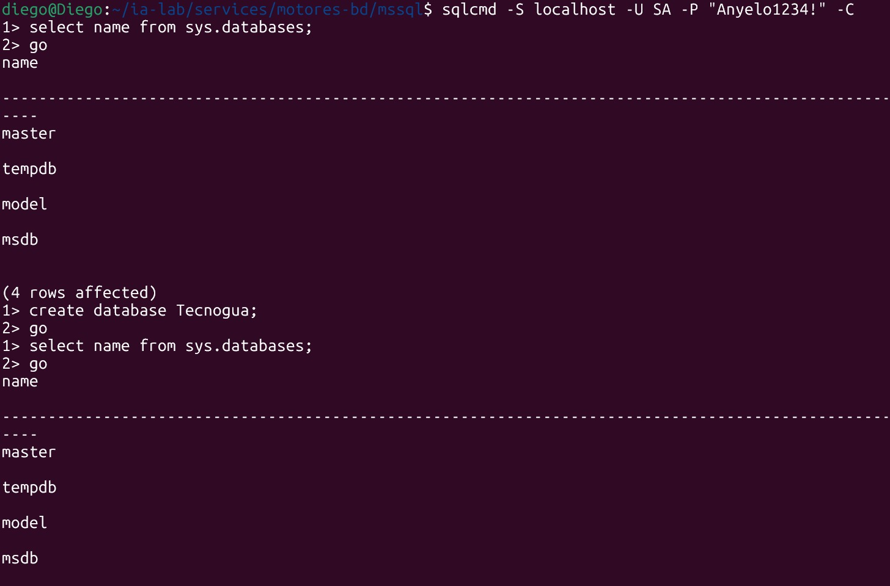

**Resultado:** Me conecté al servidor mediante `sqlcmd` con el usuario administrador, consulté las bases de datos iniciales y creé la base de datos del proyecto **Tecnogua**. Posteriormente, verifiqué su incorporación en el listado del sistema, creé el inicio de sesión para el usuario `admin` con su respectiva contraseña, le asigné el rol de `sysadmin` y habilité la cuenta para su gestión.

## Conexión a la base de datos mediante DBeaver

Para administrar visualmente el motor de base de datos y la estructura del proyecto **Tecnogua**, configuré una nueva conexión en DBeaver empleando los siguientes parámetros de acceso:

* **Servidor:** `172.28.108.52`
* **Puerto:** `1433`
* **Base de datos inicial:** `Tecnogua`
* **Usuario:** `admin`
* **Contraseña:** `1234`

**Evidencia de la prueba de conexión y visualización del proyecto conectado en DBeaver**

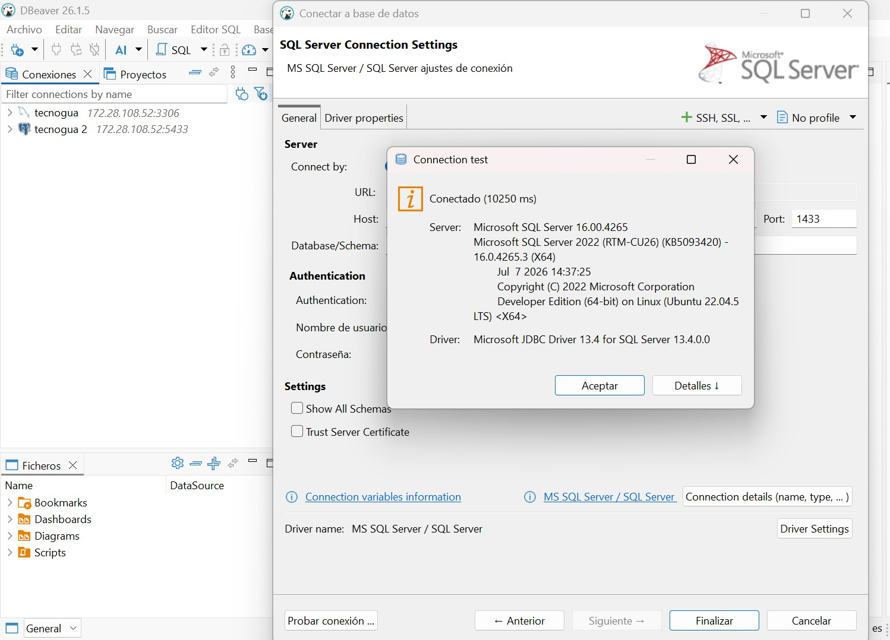

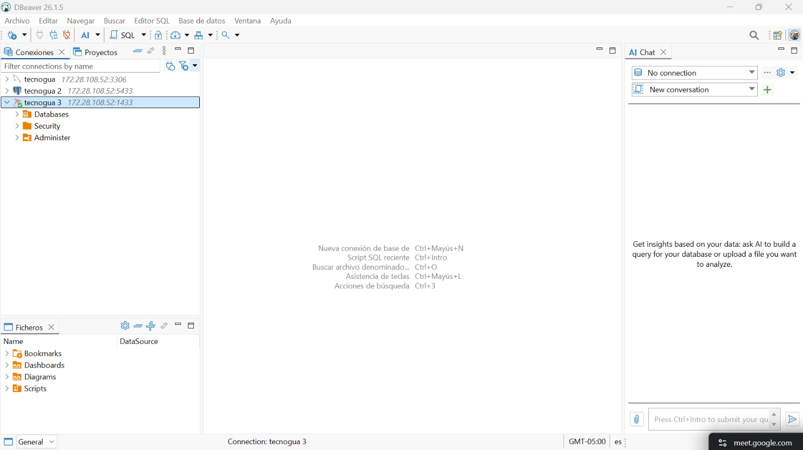

**Resultado:** Realicé la prueba de conectividad con la instancia de SQL Server 2022 obteniendo un resultado exitoso, y posteriormente verifiqué la conexión activa (`tecnogua 3`) en el panel lateral de DBeaver, confirmando el despliegue de las carpetas de administración para operar el sistema sin inconvenientes.

## Creación del archivo `docker-compose.yml` para Oracle

Para configurar y levantar el servicio de Oracle, creé el archivo de configuración con Docker Compose ejecutando el siguiente bloque en la terminal:

```bash
cat > ~/ia-lab/services/motores-bd/oracle/docker-compose.yml << 'EOF'
services:
  oracle:
    image: gvenzl/oracle-xe:21-slim
    container_name: oracle-server
    restart: unless-stopped

    env_file:
      - .env

    ports:
      - "0.0.0.0:1521:1521"

    volumes:
      - ../../../data/oracle:/opt/oracle/oradata
      - /mnt/d/academia/bd:/backups

    networks:
      - ia-lab-network

    healthcheck:
      test: ["CMD", "healthcheck.sh"]
      interval: 10s
      timeout: 5s
      retries: 10
      start_period: 120s

networks:
  ia-lab-network:
    external: true
EOF
```
**Evidencia de la creación del archivo de configuración para Oracle en la terminal**

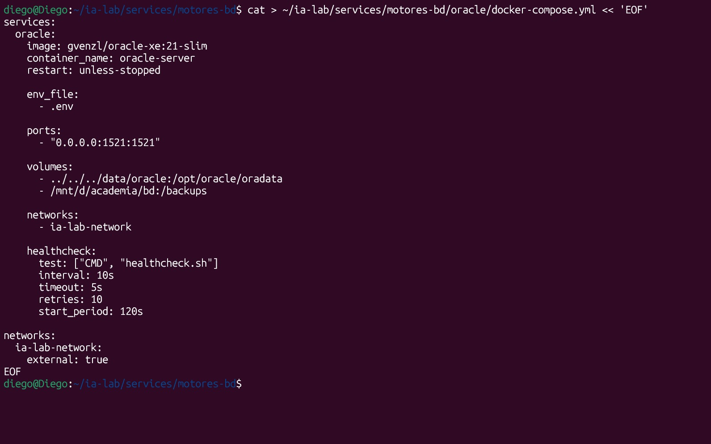

**Resultado:** Generé correctamente la estructura del archivo `docker-compose.yml` dentro de la ruta del proyecto Oracle utilizando el comando `cat` y delimitándolo con `EOF`, quedando listo para el despliegue del motor de base de datos.

## Creación del archivo `.env` para Oracle

Para configurar las variables de entorno de Oracle —como la zona horaria, la contraseña de acceso y el nombre de la base de datos de nuestro proyecto **Tecnogua**—, creé y guardé el archivo `.env` ejecutando el siguiente bloque en la terminal:

```bash
cat > ~/ia-lab/services/motores-bd/oracle/.env << 'EOF'
TZ=America/Bogota
ORACLE_PASSWORD=1234
ORACLE_DATABASE=Tecnogua
EOF
```
Para comprobar y visualizar el contenido que quedó almacenado dentro del archivo .env, utilicé la siguiente instrucción:
```bash
cat ~/ia-lab/services/motores-bd/oracle/.env
```
**Evidencia de la creación y verificación del archivo `.env` para Oracle en la terminal**

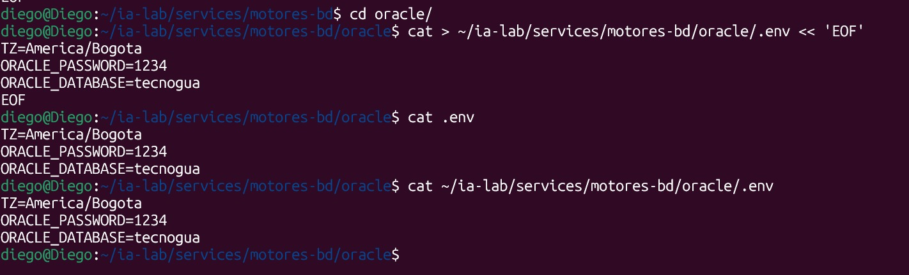

**Resultado:** Me ubiqué en la carpeta de Oracle, creé y configuré el archivo `.env` con los parámetros de la zona horaria, contraseña y la base de datos `tecnogua`, y posteriormente utilicé el comando `cat` para verificar de forma exitosa que los valores quedaron guardados correctamente.

## Creación del archivo `README.md` para Oracle

Para mantener documentado cada uno de los servicios de bases de datos dentro de la arquitectura de mi laboratorio, procedí a crear y configurar el archivo `README.md` correspondiente al motor Oracle ejecutando los siguientes comandos en la terminal:

```bash
touch ~/ia-lab/services/motores-bd/oracle/README.md
sudo nano ~/ia-lab/services/motores-bd/oracle/README.md
```
Dentro del archivo agregué la siguiente estructura informativa y de conexión para el proyecto Tecnogua:

```bash
# Oracle XE - Motor de Base de Datos

> **Acceso remoto habilitado.** Puerto expuesto en `0.0.0.0:1521`.
> **Usuario por defecto:** `SYSTEM`
> **PDB / Service Name:** `tecnogua`
> **Password:** `1234`

---

## Conectar desde WSL (local)

sudo docker exec -it oracle-server sqlplus 'system/1234@//localhost:1521/tecnogua'
```
Para comprobar y verificar que el archivo y su contenido se crearon correctamente, ejecuté la siguiente instrucción:
```bash
cat ~/ia-lab/services/motores-bd/oracle/README.md
```
**Evidencia de la creación y verificación del archivo `README.md` de Oracle en la terminal**

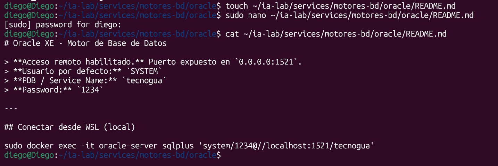

**Resultado:** Creé y edité el archivo `README.md` con la documentación y los parámetros de conexión de Oracle para el proyecto **Tecnogua**, y utilicé el comando `cat` para confirmar de manera exitosa que toda la información quedó guardada y estructurada de forma correcta en la terminal.

## Levantamiento del contenedor de Oracle

Para encender el servicio de base de datos, ingresé a la carpeta correspondiente de Oracle y levanté el contenedor en segundo plano ejecutando los siguientes comandos:

```bash
cd ~/ia-lab/services/motores-bd/oracle
sudo docker compose up -d
```
Para verificar que el contenedor oracle-server se encuentra corriendo correctamente y revisar sus últimos 30 mensajes de registro, utilicé las siguientes instrucciones:
```bash
sudo docker ps | grep oracle-server
sudo docker logs oracle-server --tail 30
```
**Evidencia del levantamiento y verificación del contenedor de Oracle en la terminal**

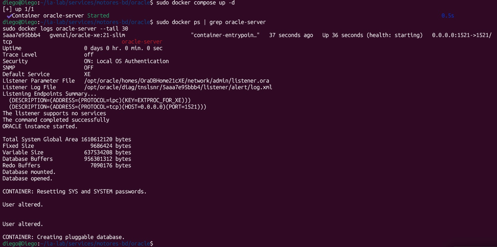

**Resultado:** Desplegué correctamente el contenedor `oracle-server` mediante Docker Compose en segundo plano, verifiqué su ejecución con `docker ps` y comprobé en los logs el inicio exitoso de la instancia, la apertura de la base de datos y la creación de la base de datos pluggable (`PDB`).

## Revisión y corrección de permisos de los datos en Oracle

Primero revisé los permisos y el contenido de la carpeta de datos de Oracle ejecutando las siguientes instrucciones:

```bash
ls -ld ~/ia-lab/data/oracle
sudo ls -la ~/ia-lab/data/oracle
```
Luego detuve el contenedor:
```bash
sudo docker compose down
```
Para asegurar que Oracle pudiera escribir correctamente en su directorio, cambié el propietario de la carpeta utilizando el UID y GID internos del contenedor (54321:54321) y otorgué los permisos necesarios de lectura y escritura:
```bash
sudo chown -R 54321:54321 ~/ia-lab/data/oracle
sudo chmod -R 775 ~/ia-lab/data/oracle
```
Posteriormente, volví a iniciar el servicio de Oracle:
```bash
sudo docker compose up -d
```
Para comprobar nuevamente el estado del contenedor y confirmar que el puerto quedó correctamente publicado, ejecuté:

```bash
sudo docker ps | grep oracle-server
```
El resultado esperado muestra el contenedor en ejecución:
```bash
oracle-server   Up 10 seconds (health: starting)   0.0.0.0:1521->1521/tcp
```
También revisé los últimos 30 registros del contenedor para verificar el estado del listener:
```bash
sudo docker logs oracle-server --tail 30
```
En la salida busqué la línea que confirma la correcta inicialización del servicio en la red:
```bash
Listening on: (DESCRIPTION=(ADDRESS=(PROTOCOL=tcp)(HOST=0.0.0.0)(PORT=1521)))
```
Este mensaje confirmó que el listener de Oracle quedó escuchando en el puerto 1521 y que el contenedor completó satisfactoriamente su proceso de arranque.
**Evidencia de la verificación del estado y los registros del contenedor de Oracle**

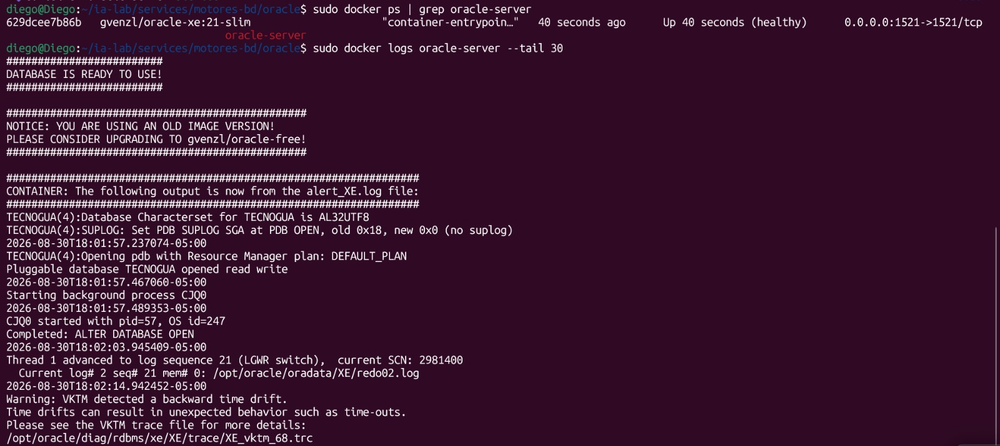

**Resultado:** Confirmé mediante `docker ps` que el contenedor `oracle-server` se encuentra ejecutándose con estado saludable (`healthy`) y expuesto en el puerto `1521`. Asimismo, al revisar los registros en los últimos mensajes de la terminal, comprobé que el motor indicó `DATABASE IS READY TO USE!` y que la base de datos pluggable (`TECNOGUA`) se abrió exitosamente en modo lectura y escritura.
## Conectar localmente a Oracle

Para conectarme al contenedor de Oracle XE de forma local, ingresé al entorno ejecutando el siguiente comando en la terminal:

```bash
sudo docker exec -it oracle-server bash
```
Una vez dentro, me conecté a Oracle utilizando el usuario administrador SYSTEM, la contraseña 1234 y el PDB correspondiente al proyecto tecnogua:
```bash
sqlplus 'system/1234@//localhost:1521/tecnogua'
```
Tuve presente que al entrar al contenedor aparece primero el indicador bash-4.4$, lo que indica que sigo en Bash y no en SQLPlus. Si intentaba escribir comandos de Oracle como SELECT, CONN, DESC o EXIT en ese punto, la terminal de Linux arrojaba un error; para poder ejecutarlos correctamente es necesario encontrarse dentro de SQLPlus, donde el aviso cambia a SQL>.

Ya dentro del motor, creé el usuario admin que utilizaré como esquema del proyecto Tecnogua, ejecutando las siguientes instrucciones:
```bash
CREATE USER admin IDENTIFIED BY "1234" DEFAULT TABLESPACE USERS QUOTA UNLIMITED ON USERS;
ALTER USER admin QUOTA UNLIMITED ON USERS;
GRANT CONNECT, RESOURCE TO admin;
```
Finalmente, para salir del motor de base de datos utilicé:
```bash
EXIT;
```
**Evidencia de la conexión a SQL*Plus y la creación del usuario administrador en Oracle**

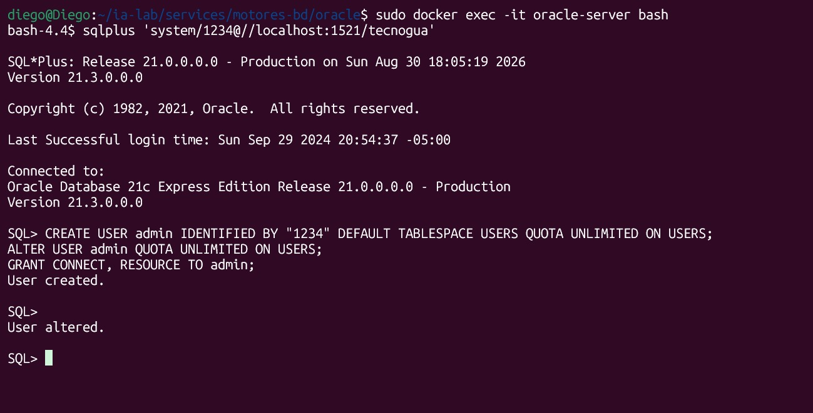

**Resultado:** Accedí al contenedor mediante el shell, inicié sesión en la base de datos pluggable `tecnogua` usando SQL*Plus con las credenciales del sistema, y ejecuté con éxito las instrucciones SQL para crear el usuario `admin`, asignarle cuotas ilimitadas en el tablespace y otorgarle los privilegios de conexión y recursos necesarios para operar el proyecto.

## Creación de un usuario propio con acceso remoto

Para crear y administrar mi propio usuario con acceso remoto, me conecté nuevamente como `SYSTEM` al PDB del proyecto **Tecnogua** siguiendo estos pasos detallados:

### Paso 1: Entrar al contenedor
Accedí al entorno ejecutando el siguiente comando:
```bash
sudo docker exec -it oracle-server bash
```
Esperé a que apareciera el indicador bash-4.4$ en la terminal.

Paso 2: Iniciar SQL*Plus como SYSTEM
Me conecté a la base de datos con las credenciales de administrador:
```bash
sqlplus 'system/1234@//localhost:1521/tecnogua'
```
Espere a que apareciera el indicador SQL> antes de continuar con la ejecución de los comandos en el motor.

Paso 3: Conectarme al usuario admin
Una vez dentro, cambié la sesión al esquema previamente creado:
```bash
CONN admin/1234@//localhost:1521/tecnogua
```
Paso 4: Consultar los usuarios o esquemas
Para verificar los usuarios disponibles dentro de la base de datos, ejecuté la siguiente consulta:
```bash
SELECT username FROM all_users ORDER BY username;
```
**Evidencia de la consulta de usuarios registrados en la base de datos**

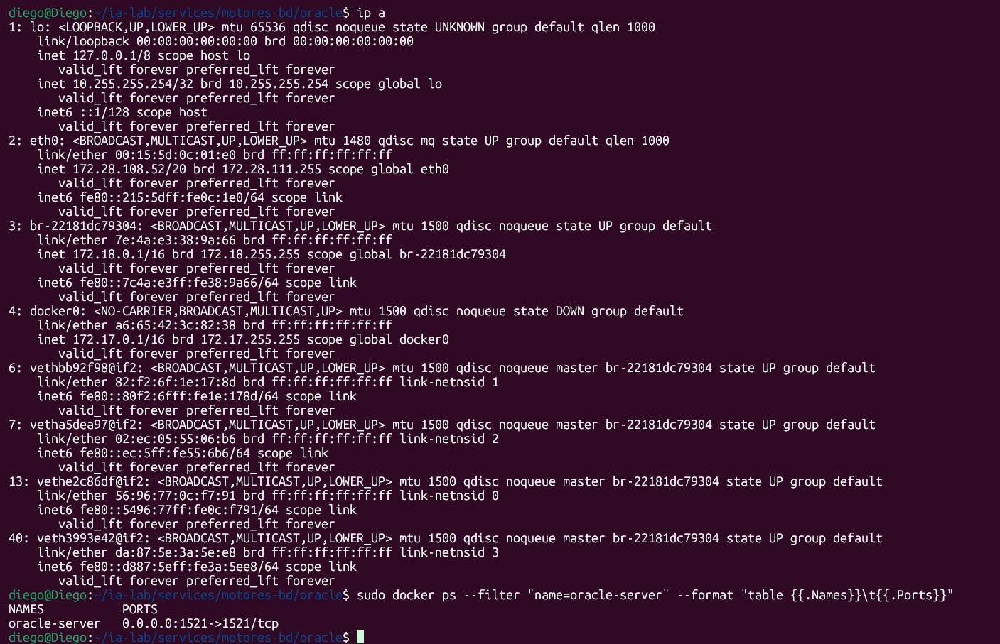

**Resultado:** Ejecuté con éxito la consulta SQL sobre la vista `all_users` y obtuve como respuesta la lista completa de los 28 usuarios y esquemas disponibles en la base de datos, entre los cuales figura el usuario `ADMIN` recién creado junto con los perfiles del sistema de Oracle.
## Conectar remotamente desde cualquier equipo

### Conectar usando DBeaver

Para establecer una conexión remota a Oracle XE desde DBeaver, primero consulté la dirección IP del equipo host donde corre Docker ejecutando el siguiente comando en la terminal:

```bash
ip a
```
En la salida del comando busqué la interfaz eth0 para obtener la dirección IP, utilizando en mi caso la IP 172.21.63.86 como el valor del Host.

Asimismo, verifiqué que el contenedor estuviera activo y que el puerto 1521 se encontrara correctamente publicado ejecutando la siguiente instrucción:

```bash
sudo docker ps --filter "name=oracle-server" --format "table {{.Names}}\t{{.Ports}}"
```

Para realizar la conexión desde DBeaver, verifiqué previamente que la interfaz `eth0` tenía asignada la dirección IP `172.28.108.52` mediante el comando `ip a`, y confirmé que el contenedor `oracle-server` se encontraba activo con el puerto `1521` abierto al exterior (`0.0.0.0:1521->1521/tcp`). 

A continuación, completé el proceso en la interfaz de DBeaver siguiendo estos pasos:

1. Abrí el programa DBeaver.
2. Hice clic en **Nueva conexión**.
3. Seleccioné el controlador de **Oracle**.
4. En la pestaña **Basic**, configuré los parámetros de la siguiente manera:
   - Ingresé `172.28.108.52` en el campo **Host**.
   - Coloque `1521` en **Port**.
   - Escribí `tecnogua` en el campo **Database**.
   - Cambié el selector ubicado a la derecha de Database a la opción **Service Name**.
   - Digité `admin` en **Nombre de usuario**.
   - Introduje `1234` en **Contraseña**.
   - Dejé seleccionado **Normal** en el campo **Role**.
   - Mantuve **Username/password** en **Authentication**.
   - Dejé el campo **Local Client** como `<not present>`.
5. Hice clic en **Probar conexión...** para validar la comunicación.
6. Una vez la prueba fue exitosa, presioné **Finalizar** para guardar los ajustes de la conexión.

**Evidencias de la configuración de conexión en DBeaver**

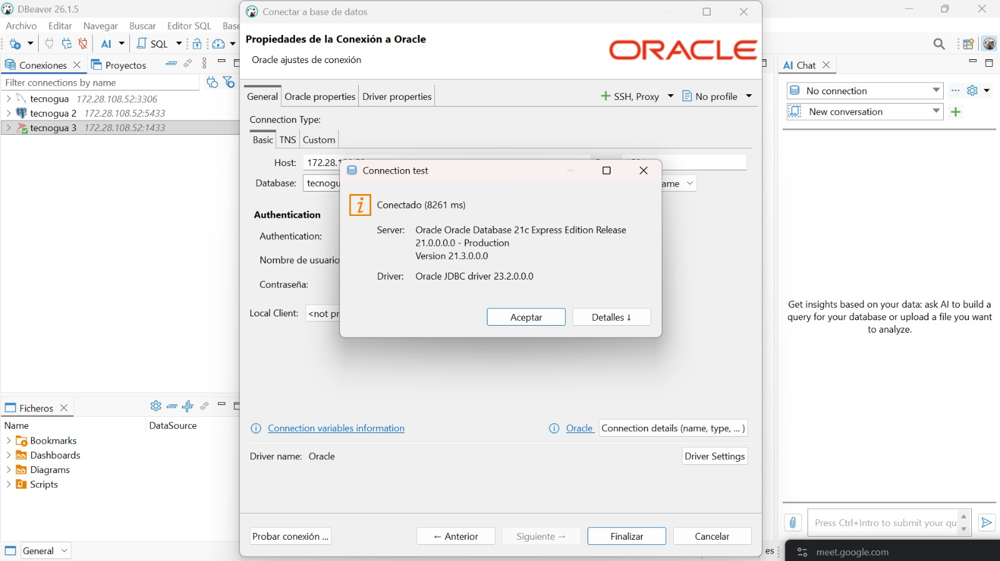

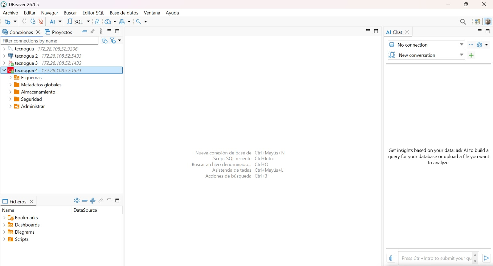

Con esta configuración se comprobó de manera exitosa la comunicación remota con el motor de base de datos Oracle XE a través de DBeaver, permitiendo visualizar los esquemas y componentes del proyecto de forma integrada.