# creación de la base de datos mysql

## creación de la base de datos por el terminal DBeaver

``` sql
CREATE DATABASE SuministroPro;
```

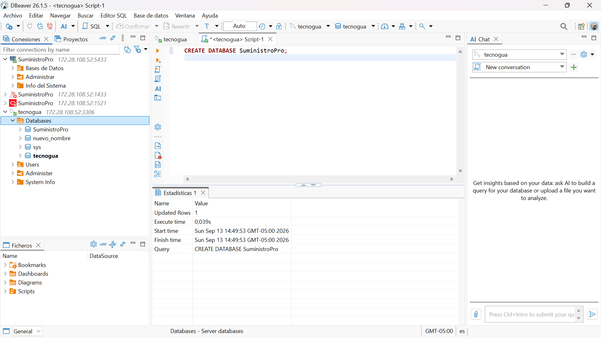

## creación de la tabla products en el terminal Dbeaver mysql

``` sql
CREATE TABLE products (
    id INT AUTO_INCREMENT PRIMARY KEY ,
    sku VARCHAR(50) NOT NULL UNIQUE,
    name VARCHAR(150) NOT NULL,
    description VARCHAR(225),
    price DECIMAL(12,2) NOT NULL,
    status enum('active','inactive'),
    created_at DATETIME NOT NULL,
    updated_at DATETIME NOT NULL
);
```

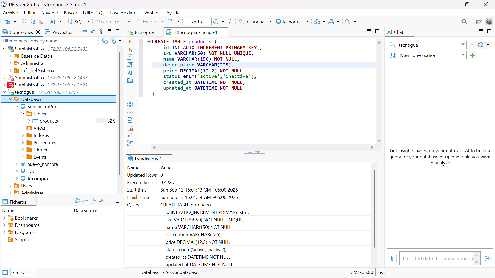

## creación de la tabla suppliers en la terminal Dbeaver mysql

``` sql
CREATE TABLE suppliers (
    id INT AUTO_INCREMENT PRIMARY KEY,
    nit VARCHAR(30) NOT NULL UNIQUE,
    company_name VARCHAR(150) NOT NULL,
    contact_person VARCHAR(100),
    phone VARCHAR(30),
    email VARCHAR(100),
    status ENUM('active','inactive'),
    created_at DATETIME NOT NULL,
    updated_at DATETIME NOT NULL
);
```

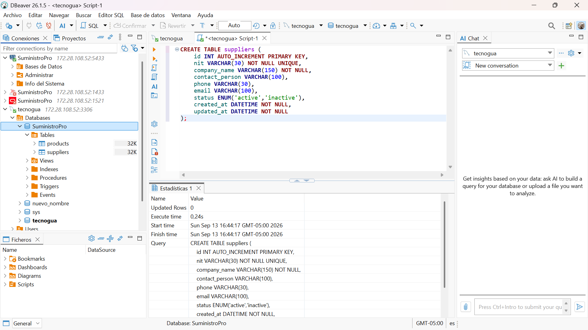

## creación de la tabla purchaces en el terminal Dbeaver mysql

``` sql
CREATE TABLE purchases (
    id INT AUTO_INCREMENT PRIMARY KEY,
    supplier_id INT NOT NULL,
    purchase_date DATETIME NOT NULL,
    subtotal DECIMAL(12,2) NOT NULL,
    taxes DECIMAL(12,2) NOT NULL,
    total DECIMAL(12,2) NOT NULL,
    state VARCHAR(30) NOT NULL,
    status ENUM('active','inactive'),
    created_at DATETIME NOT NULL,
    updated_at DATETIME NOT NULL,
    FOREIGN KEY (supplier_id) REFERENCES suppliers(id)
);
```

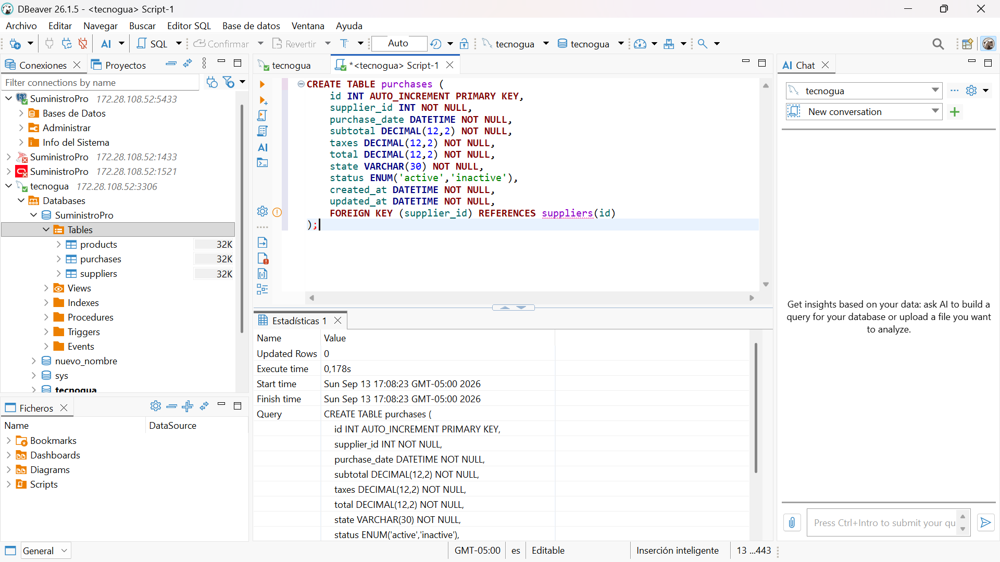

## creación de la tabla parchease_details en la terminal dbeaver mysql

``` sql
CREATE TABLE purchase_details (
    id INT AUTO_INCREMENT PRIMARY KEY,
    purchase_id INT NOT NULL,
    product_id INT NOT NULL,
    quantity INT NOT NULL,
    unit_price DECIMAL(12,2) NOT NULL,
    total DECIMAL(12,2) NOT NULL,
    notes TEXT,
    status ENUM('active','inactive'),
    created_at DATETIME NOT NULL,
    updated_at DATETIME NOT NULL,
    FOREIGN KEY (purchase_id) REFERENCES purchases(id),
    FOREIGN KEY (product_id) REFERENCES products(id)
);
```

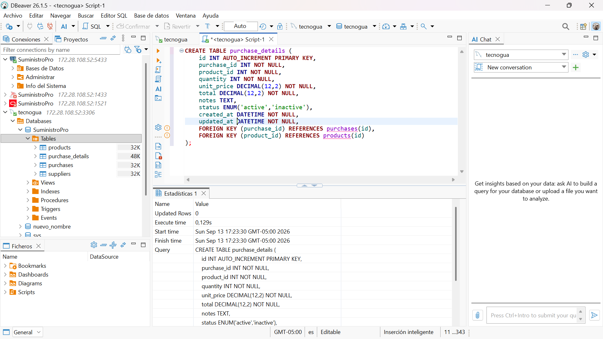

## creación de la tabla inventories en la terminal dbeaver mysql

``` sql
CREATE TABLE inventories (
    id INT AUTO_INCREMENT PRIMARY KEY,
    location_id INT NOT NULL,
    product_id INT NOT NULL,
    quantity INT NOT NULL,
    minimum_stock INT NOT NULL,
    status ENUM('active','inactive'),
    created_at DATETIME NOT NULL,
    updated_at DATETIME NOT NULL,
    FOREIGN KEY (product_id) REFERENCES products(id)
);
```

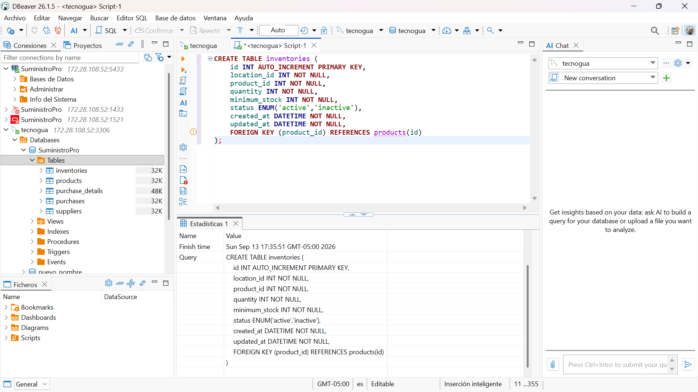

## creación de la tabla customers en la terminal de dbeaver mysql

``` sql
CREATE TABLE customers (
    id INT AUTO_INCREMENT PRIMARY KEY,
    document_type VARCHAR(20) NOT NULL,
    document_number VARCHAR(30) NOT NULL UNIQUE,
    full_name VARCHAR(150) NOT NULL,
    phone VARCHAR(30),
    email VARCHAR(100),
    status ENUM('active','inactive'),
    created_at DATETIME NOT NULL,
    updated_at DATETIME NOT NULL
);
```

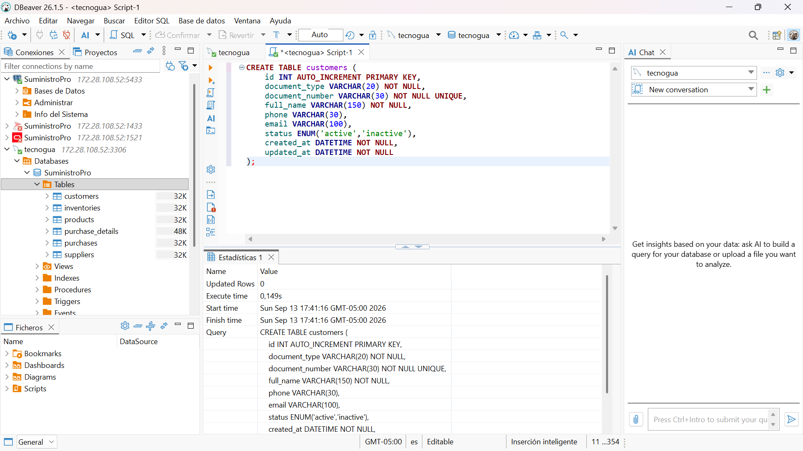

## creación de la tabla sales en la terminal de dbeaver mysql

``` sql
CREATE TABLE sales (
    id INT AUTO_INCREMENT PRIMARY KEY,
    customer_id INT NOT NULL,
    sale_date DATETIME NOT NULL,
    subtotal DECIMAL(12,2) NOT NULL,
    taxes DECIMAL(12,2) NOT NULL,
    total DECIMAL(12,2) NOT NULL,
    state VARCHAR(30) NOT NULL,
    status ENUM('active','inactive'),
    created_at DATETIME NOT NULL,
    updated_at DATETIME NOT NULL,
    FOREIGN KEY (customer_id) REFERENCES customers(id)
);
```

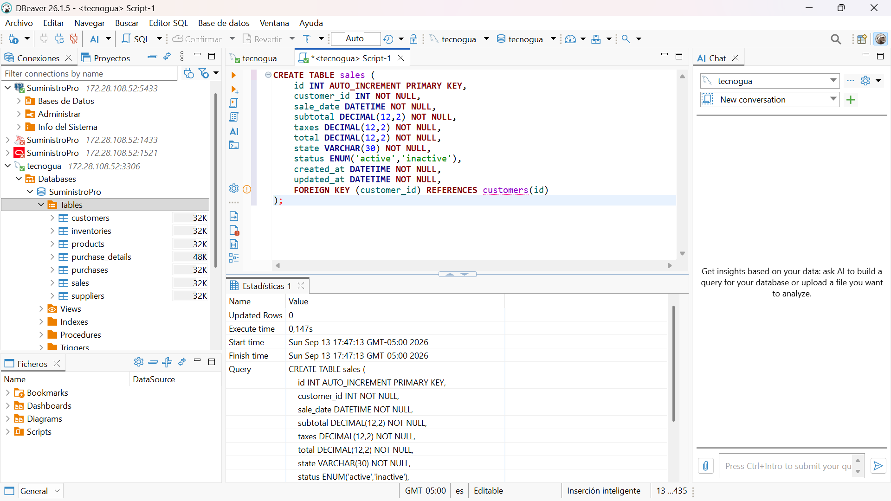

## creación de la tabla sale_details en la terminal de dbeaver mysql

``` sql
CREATE TABLE sale_details (
    id INT AUTO_INCREMENT PRIMARY KEY,
    sale_id INT NOT NULL,
    product_id INT NOT NULL,
    quantity INT NOT NULL,
    unit_price DECIMAL(12,2) NOT NULL,
    total DECIMAL(12,2) NOT NULL,
    notes TEXT,
    status ENUM('active','inactive'),
    created_at DATETIME NOT NULL,
    updated_at DATETIME NOT NULL,
    FOREIGN KEY (sale_id) REFERENCES sales(id),
    FOREIGN KEY (product_id) REFERENCES products(id)
);
```

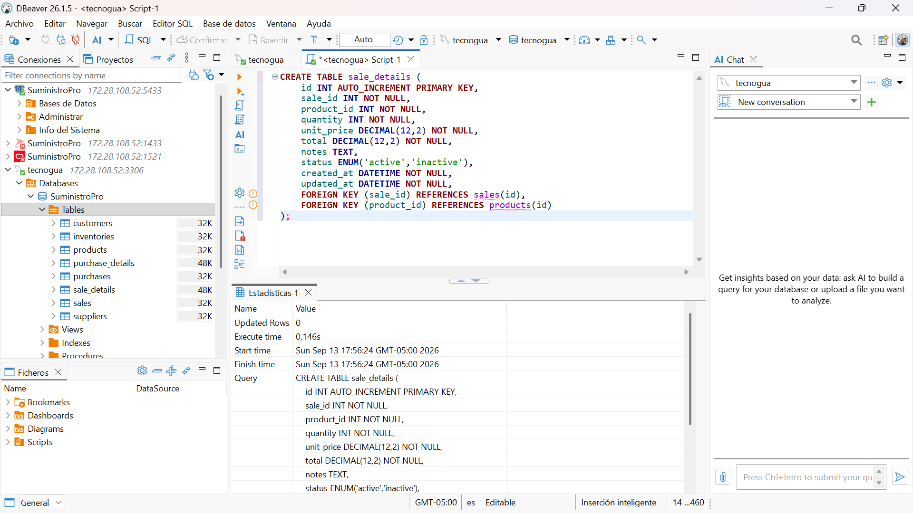

## creación de la tabla accounts_receivable en la terminal dbeaver mysql

``` sql
CREATE TABLE accounts_receivable (
    id INT AUTO_INCREMENT PRIMARY KEY,
    sale_id INT NOT NULL UNIQUE,
    issue_date DATETIME NOT NULL,
    amount DECIMAL(12,2) NOT NULL,
    state VARCHAR(30) NOT NULL,
    notes TEXT,
    status ENUM('active','inactive'),
    created_at DATETIME NOT NULL,
    updated_at DATETIME NOT NULL,
    FOREIGN KEY (sale_id) REFERENCES sales(id)
);
```

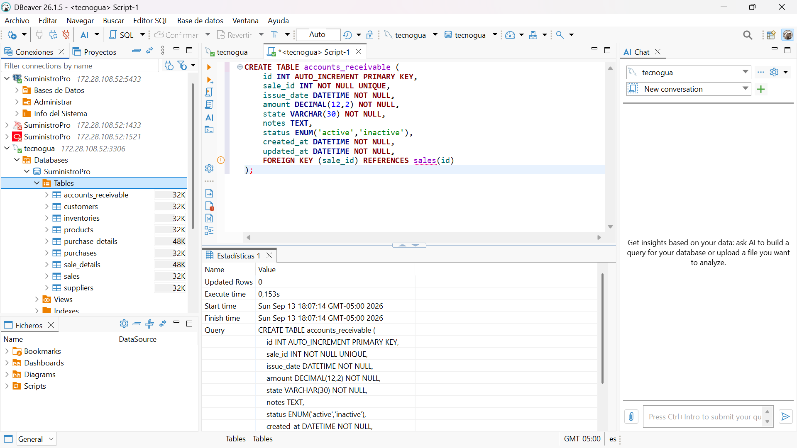

## creacion de la tabla receivable_pyments en la terminal dbeaver mysql

``` sql
CREATE TABLE receivable_payments (
    id INT AUTO_INCREMENT PRIMARY KEY,
    account_receivable_id INT NOT NULL,
    payment_date DATETIME NOT NULL,
    amount DECIMAL(12,2) NOT NULL,
    state VARCHAR(30) NOT NULL,
    notes TEXT,
    status ENUM('active','inactive'),
    created_at DATETIME NOT NULL,
    updated_at DATETIME NOT NULL,
    FOREIGN KEY (account_receivable_id) REFERENCES accounts_receivable(id)
);
```

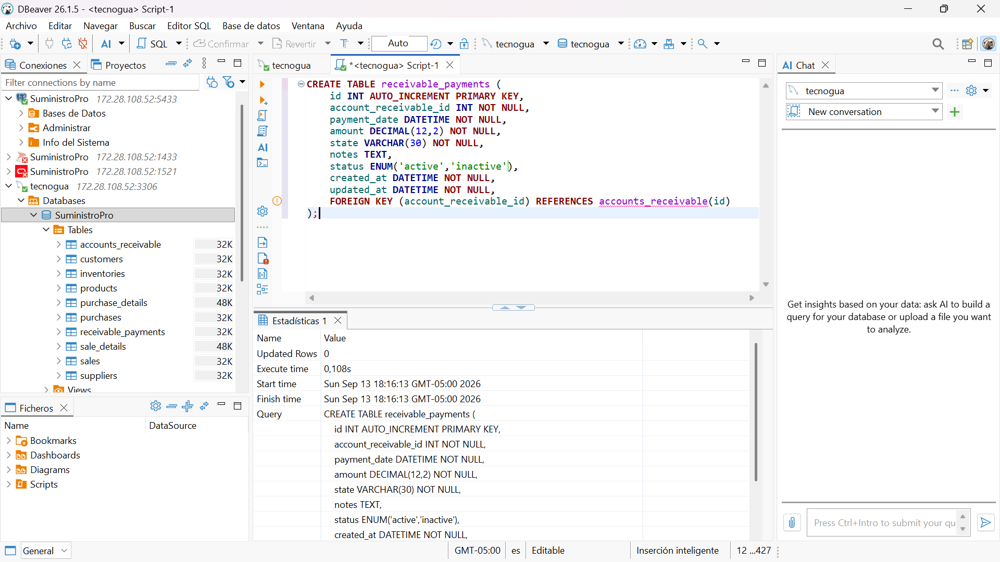

## creación de la tabla returns en la terminal dbeaver mysql

``` sql
CREATE TABLE returns (
    id INT AUTO_INCREMENT PRIMARY KEY,
    sale_id INT NOT NULL,
    return_date DATETIME NOT NULL,
    reason TEXT NOT NULL,
    total DECIMAL(12,2) NOT NULL,
    state VARCHAR(30) NOT NULL,
    status ENUM('active','inactive'),
    created_at DATETIME NOT NULL,
    updated_at DATETIME NOT NULL,
    FOREIGN KEY (sale_id) REFERENCES sales(id)
);
```

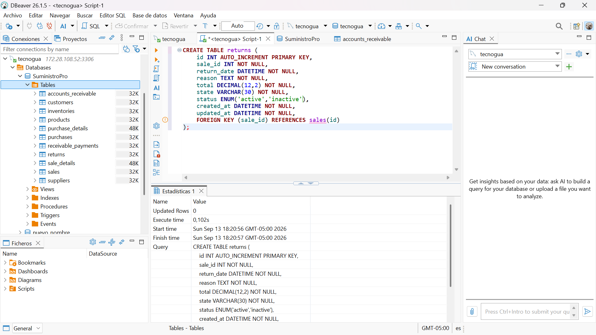

## creación de la base de datos en el gestor workbench

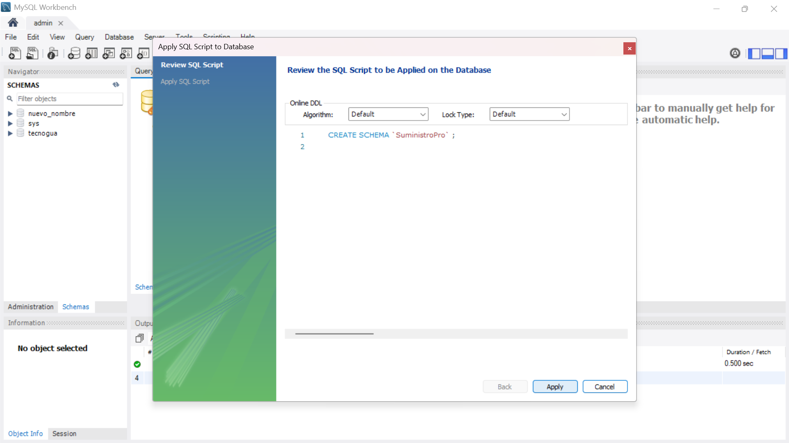

## creación de la tabla products en workbench

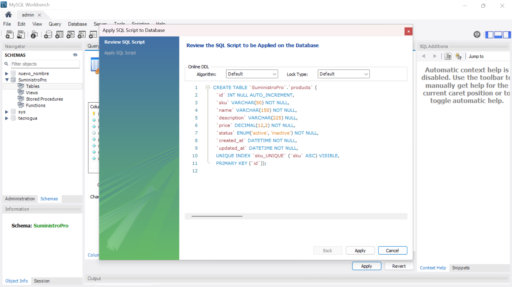

## creación de la tabla suppliers  en workbench

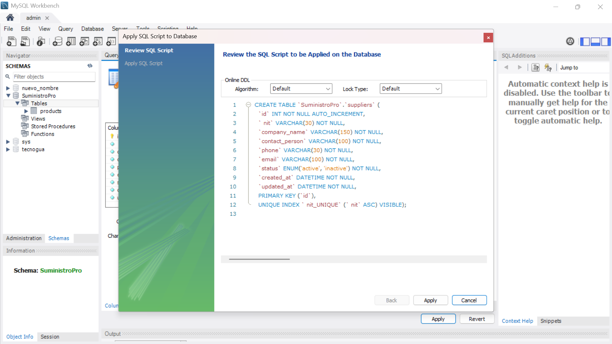

## creación de la tabla purchases  en workbench

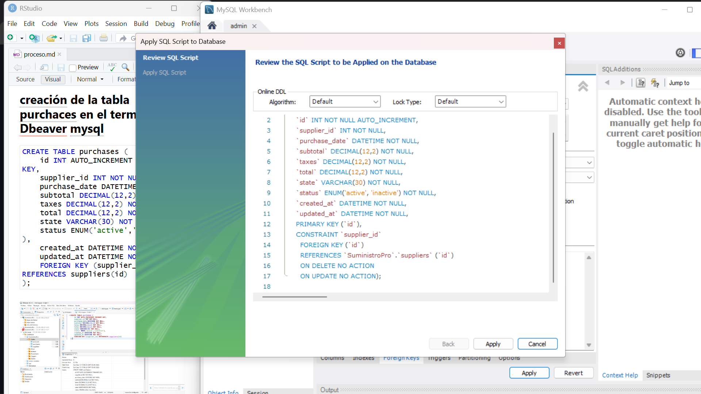

## creación de la tabla parchease_details   en workbench

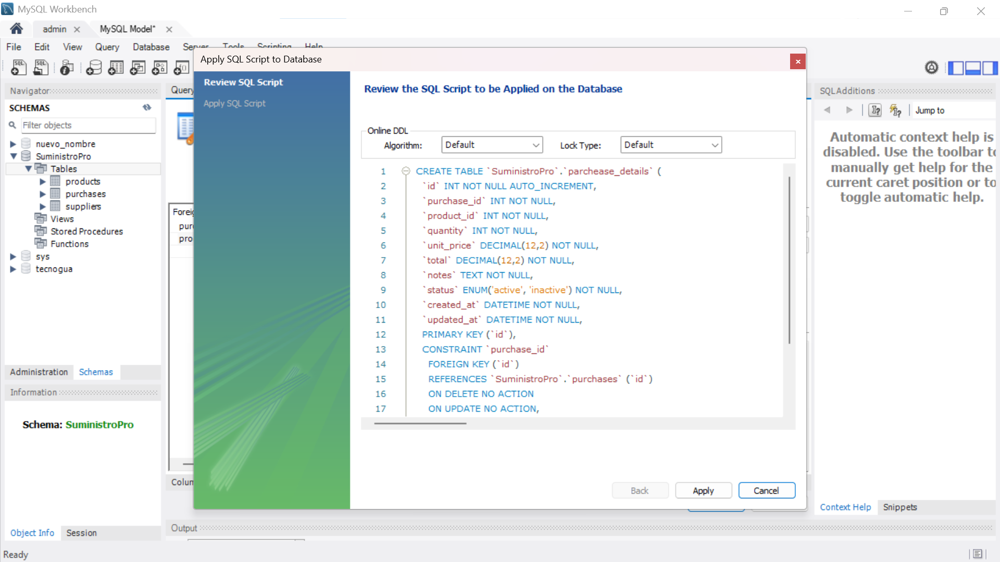

## creación de la tabla inventories en workbench


## creación de la tabla customers en workbench

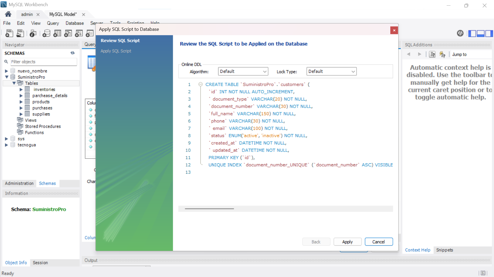

## creación de la tabla sales en workbench

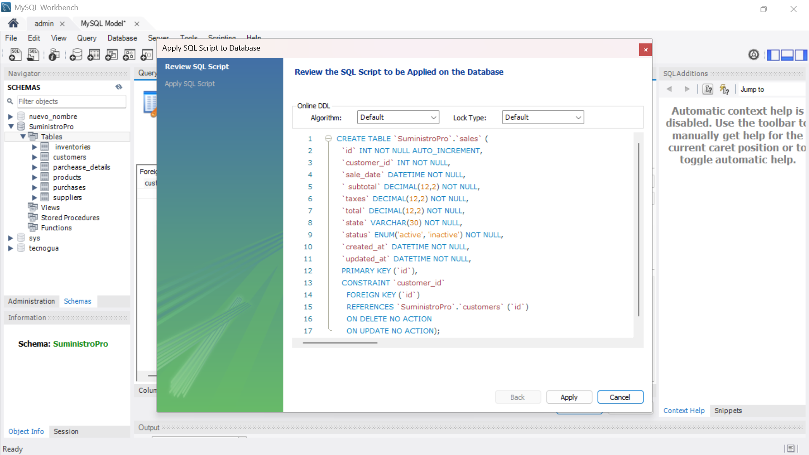

## creación de la tabla sale_details en workbench

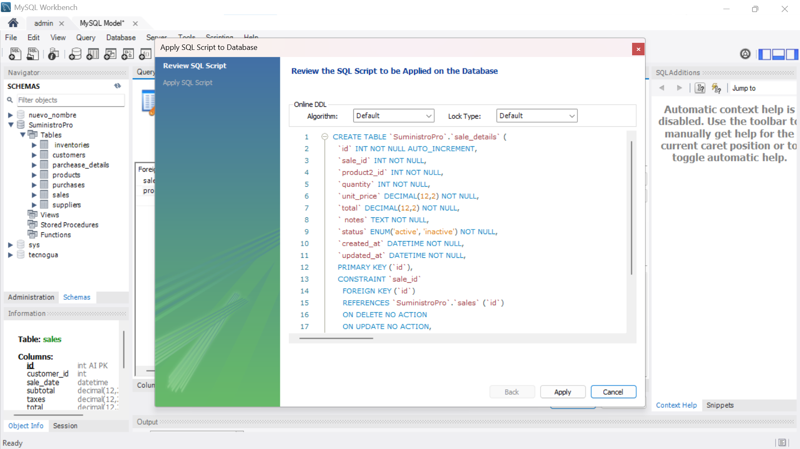

## creación de la tabla accounts_receivable en workbench

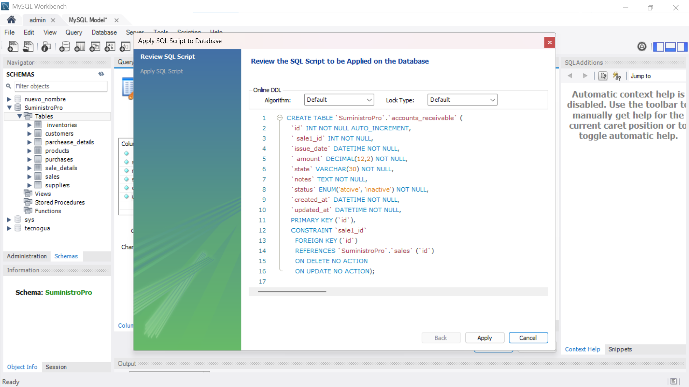

## creación de la tabla receivable_payments en workbench

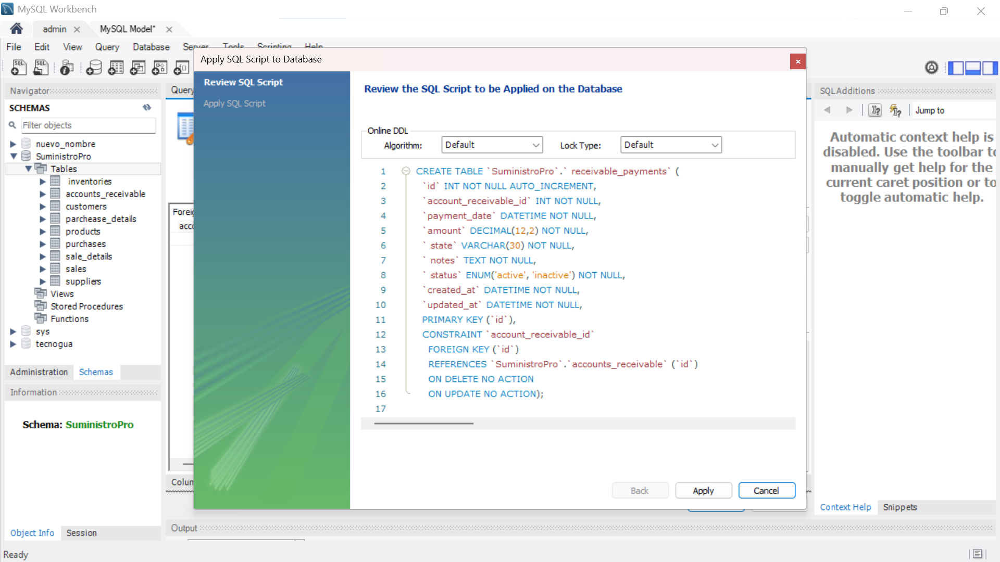

## creación de la tabla returns en workbench

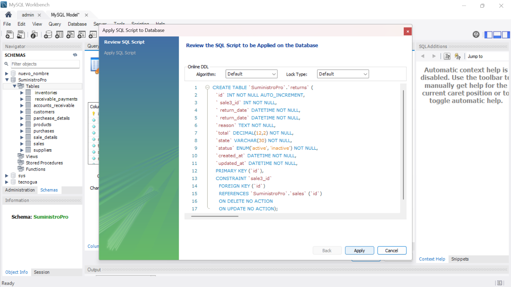

# creación de mi base de datos en postgres

# creación de mi base dato en la termina dbeaver

``` sql
create database SumintroPro;
```

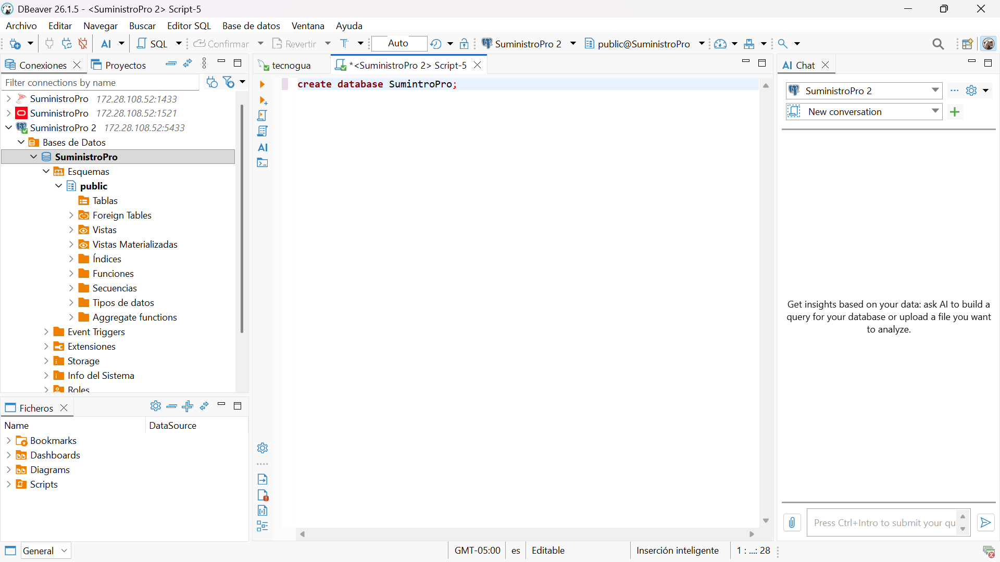

# creación de la tabla products en la termina dbeaver postgres

``` sql
CREATE TABLE products (
    id SERIAL PRIMARY KEY,
    sku VARCHAR(50) NOT NULL UNIQUE,
    name VARCHAR(150) NOT NULL,
    description VARCHAR(225),
    price DECIMAL(12,2) NOT NULL,
    status VARCHAR(10) CHECK (status IN ('active', 'inactive')) DEFAULT 'active',
    created_at TIMESTAMP NOT NULL DEFAULT CURRENT_TIMESTAMP,
    updated_at TIMESTAMP NOT NULL DEFAULT CURRENT_TIMESTAMP
);
```

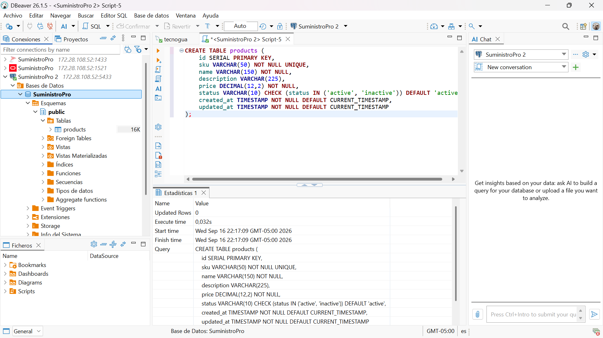

# creación de la tabla suppliers en la termina dbeaver postgres

``` sql
CREATE TABLE suppliers (
    id SERIAL PRIMARY KEY,
    nit VARCHAR(30) NOT NULL UNIQUE,
    company_name VARCHAR(150) NOT NULL,
    contact_person VARCHAR(100),
    phone VARCHAR(30),
    email VARCHAR(100),
    status VARCHAR(10) CHECK (status IN ('active', 'inactive')),
    created_at TIMESTAMP NOT NULL,
    updated_at TIMESTAMP NOT NULL
);
```

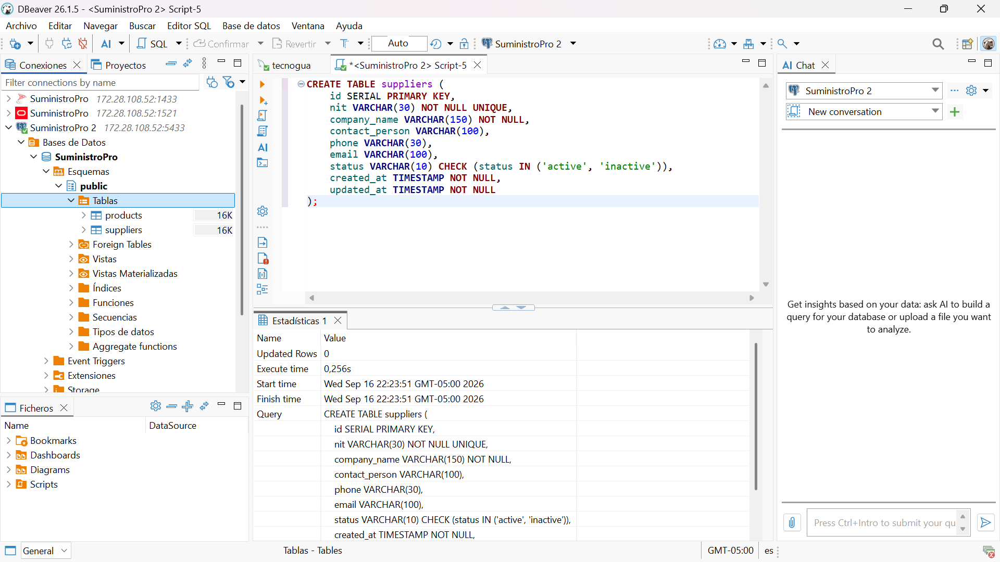

# creación de la tabla purchases en la termina dbeaver postgres

``` sql
CREATE TABLE purchases (
    id SERIAL PRIMARY KEY,
    supplier_id INT NOT NULL,
    purchase_date TIMESTAMP NOT NULL,
    subtotal DECIMAL(12,2) NOT NULL,
    taxes DECIMAL(12,2) NOT NULL,
    total DECIMAL(12,2) NOT NULL,
    state VARCHAR(30) NOT NULL,
    status VARCHAR(10) CHECK (status IN ('active', 'inactive')),
    created_at TIMESTAMP NOT NULL,
    updated_at TIMESTAMP NOT NULL,
    FOREIGN KEY (supplier_id) REFERENCES suppliers(id)
);
```

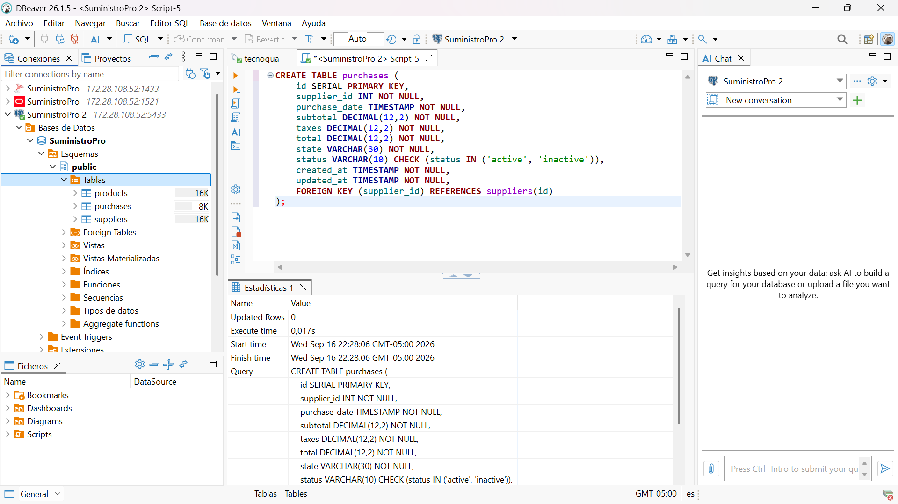

# creación de la tabla purchase_details en la termina dbeaver postgres

``` sql
CREATE TABLE purchase_details (
    id SERIAL PRIMARY KEY,
    purchase_id INT NOT NULL,
    product_id INT NOT NULL,
    quantity INT NOT NULL,
    unit_price DECIMAL(12,2) NOT NULL,
    total DECIMAL(12,2) NOT NULL,
    notes TEXT,
    status VARCHAR(10) CHECK (status IN ('active', 'inactive')),
    created_at TIMESTAMP NOT NULL,
    updated_at TIMESTAMP NOT NULL,
    FOREIGN KEY (purchase_id) REFERENCES purchases(id),
    FOREIGN KEY (product_id) REFERENCES products(id)
);
```

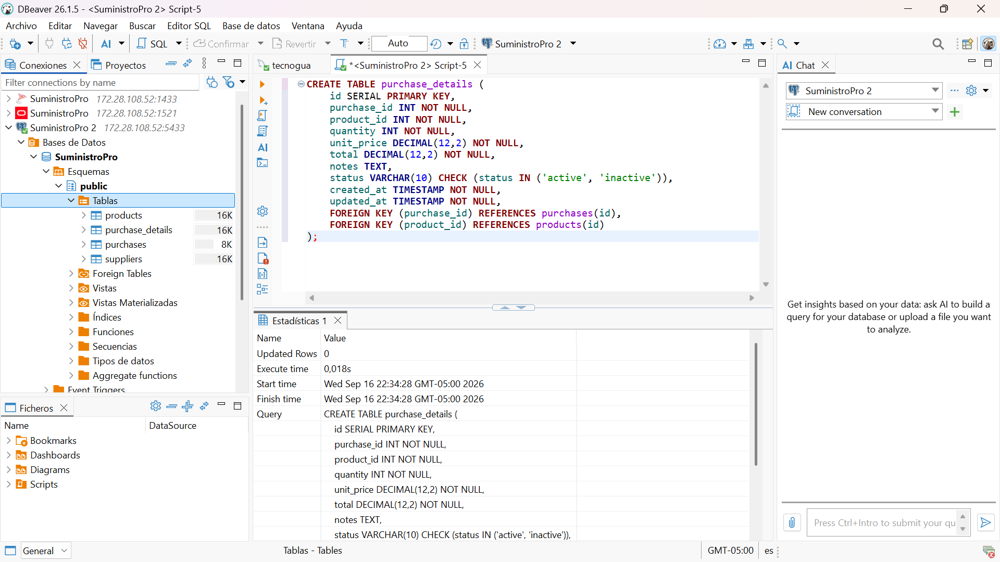

# creación de la tabla inventories en la termina dbeaver postgres

``` sql
CREATE TABLE inventories (
    id SERIAL PRIMARY KEY,
    location_id INT NOT NULL,
    product_id INT NOT NULL,
    quantity INT NOT NULL,
    minimum_stock INT NOT NULL,
    status VARCHAR(10) CHECK (status IN ('active', 'inactive')),
    created_at TIMESTAMP NOT NULL,
    updated_at TIMESTAMP NOT NULL,
    FOREIGN KEY (product_id) REFERENCES products(id)
);
```

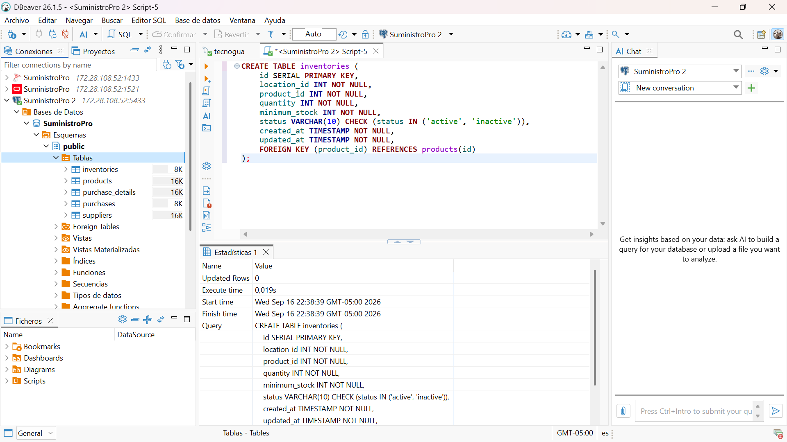

# creación de la tabla customers en la termina dbeaver postgres

``` sql
CREATE TABLE customers (
    id SERIAL PRIMARY KEY,
    document_type VARCHAR(20) NOT NULL,
    document_number VARCHAR(30) NOT NULL UNIQUE,
    full_name VARCHAR(150) NOT NULL,
    phone VARCHAR(30),
    email VARCHAR(100),
    status VARCHAR(10) CHECK (status IN ('active', 'inactive')),
    created_at TIMESTAMP NOT NULL,
    updated_at TIMESTAMP NOT NULL
);
```

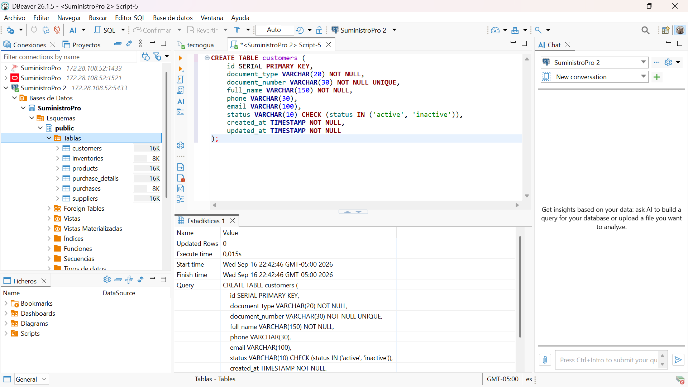
